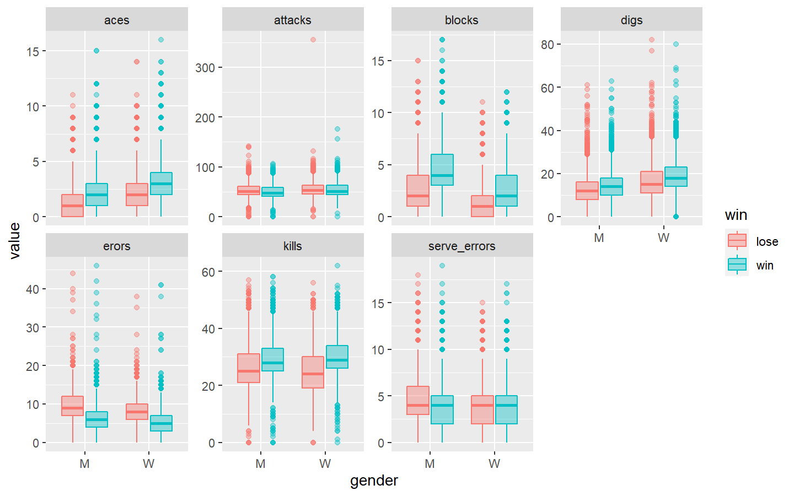
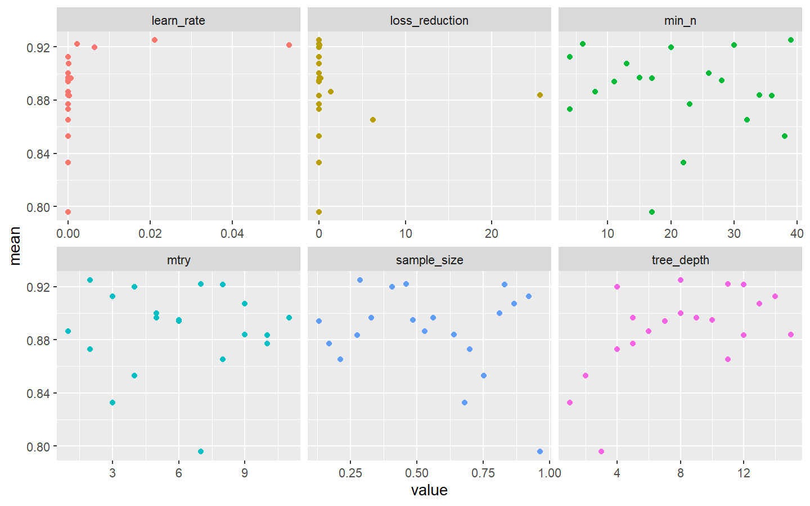
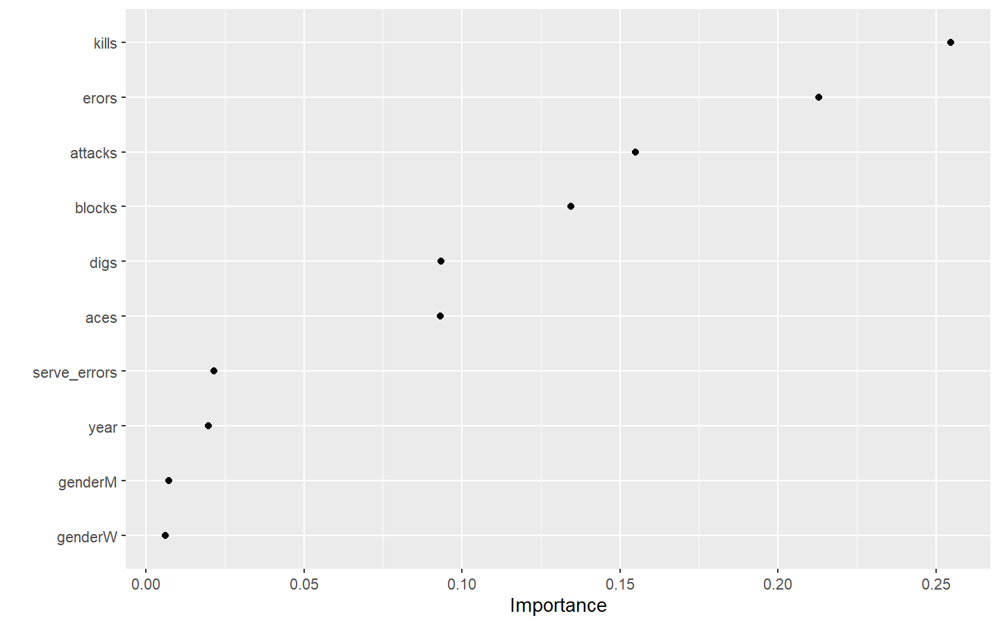
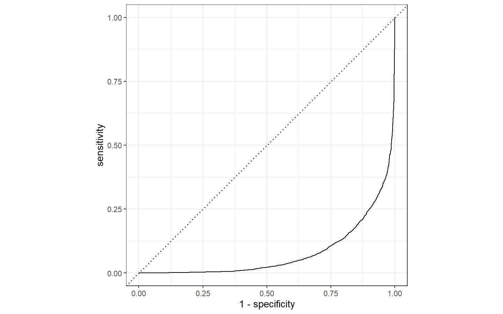

## Objective

Following Julia Silge tutorial on how to tune an xgboost model using the
TidyTuesday volley ball data. The model will predict wins from game play
stats like errors, blocks, attacks, etc.

### Explore Data

The data has one row per match. The games are two on two. The headers
with the w\_ prefix are the winning two players and the l\_ prefix are
the losing team.

We will try to control for circuit, gender, and year

The data will be reshaped to better suit building the model. We will add
the states for player 1 to player 2 and do so for both the winning and
losing team. Then make one row per outcome (win or loss)

*transmute() adds new variables and drops existing ones*

``` r
# Load the data from tidyTuesday 
vb_matches <- readr::read_csv('https://raw.githubusercontent.com/rfordatascience/tidytuesday/master/data/2020/2020-05-19/vb_matches.csv', guess_max = 76000)

# Add win + loss stats and disregard irrelevant columns...
vb_parsed <- vb_matches %>% transmute(
  circuit,
  gender,
  year,
  w_attacks = w_p1_tot_attacks + w_p2_tot_attacks,
  w_kills = w_p1_tot_kills + w_p2_tot_kills,
  w_erors = w_p1_tot_errors + w_p2_tot_errors,
  w_aces = w_p1_tot_aces + w_p2_tot_aces,
  w_serve_errors = w_p1_tot_serve_errors + w_p2_tot_serve_errors,
  w_blocks = w_p1_tot_blocks + w_p2_tot_blocks,
  w_digs = w_p1_tot_digs + w_p2_tot_digs,
  l_attacks = l_p1_tot_attacks + l_p2_tot_attacks,
  l_kills = l_p1_tot_kills + l_p2_tot_kills,
  l_erors = l_p1_tot_errors + l_p2_tot_errors,
  l_aces = l_p1_tot_aces + l_p2_tot_aces,
  l_serve_errors = l_p1_tot_serve_errors + l_p2_tot_serve_errors,
  l_blocks = l_p1_tot_blocks + l_p2_tot_blocks,
  l_digs = l_p1_tot_digs + l_p2_tot_digs
) %>% na.omit()

winners <- vb_parsed %>%
  select(circuit, gender, year, w_attacks:w_digs) %>%
  rename_with(~ str_remove_all(., "w_"), w_attacks:w_digs) %>%
  mutate(win = "win")

losers <- vb_parsed %>%
  select(circuit, gender, year, l_attacks:l_digs) %>%
  rename_with(~ str_remove_all(., "l_"), l_attacks:l_digs) %>%
  mutate(win = "lose")

vb_df <- rbind(winners, losers) %>% 
  mutate_if(is.character, factor)
```

This chart shows the data selected and how it might impact predictions

``` r
vb_df %>%
  pivot_longer(attacks:digs, names_to = "stat", values_to = "value") %>% 
  ggplot(aes(x=gender, y=value, fill=win, color = win)) +
  geom_boxplot(alpha=.4)+
  facet_wrap(~stat, scales = "free_y", nrow=2)
```



### Build Model

First split data into training and testing

``` r
library(tidymodels)

# Seperate into training / testing sets...
# Use initial_time_split to preserve the order (timeseries)?

set.seed(123)
vb_split <- initial_split(vb_df, strata = win) #Stratified sampling on win/loss
vb_train <- training(vb_split) #75%
vb_test <- testing(vb_split) #25%
```

Next, build model specification (tree parameters)

*boost_tree()* defines a model that creates a series of decision trees
forming an ensemble. Each tree depends on the results of previous trees.
All trees in the ensemble are combined to produce a final prediction.

``` r
# no preprocessing nexessary, but a lot of model parameters to tune the model

xgb_spec <- boost_tree(
  trees =1000,
  tree_depth = tune(), min_n = tune(), loss_reduction = tune(),
  sample_size = tune(), mtry = tune(), 
  learn_rate = tune() 
) %>%
  set_engine("xgboost") %>% 
  set_mode("classification")  # you can set the more to regression or
                              # classification. This will be classification
                              #because the model will predict win or lose
  xgb_spec
```

    ## Boosted Tree Model Specification (classification)
    ## 
    ## Main Arguments:
    ##   mtry = tune()
    ##   trees = 1000
    ##   min_n = tune()
    ##   tree_depth = tune()
    ##   learn_rate = tune()
    ##   loss_reduction = tune()
    ##   sample_size = tune()
    ## 
    ## Computational engine: xgboost

Two approaches to setting parameters.

1.  grid_regular - set values for each tuning parameter and try every
    combination of those. It will take a long time

2.  grid_latin_hypercube - Space filling design. fill the six
    dimensional space (the tuning elements) evenly

``` r
#Values we are going to try...

xgb_grid <- grid_latin_hypercube(
  tree_depth(),
  min_n(),
  loss_reduction(),
  sample_size = sample_prop(), #sample_size needs to be a proportion 
  finalize(mtry(), vb_train), # mtry contains an unknown (you need the data 
                              # to determine the value. So using the finalize()
                              # function to determine the values
  learn_rate(),
  size = 20 # 20 different models - you might want to do more 
)

xgb_grid
```

    ## # A tibble: 20 x 6
    ##    tree_depth min_n loss_reduction sample_size  mtry learn_rate
    ##         <int> <int>          <dbl>       <dbl> <int>      <dbl>
    ##  1         11    32       6.25e+ 0       0.211     8   4.34e-10
    ##  2          7    11       8.29e- 5       0.131     6   5.04e- 5
    ##  3          8    39       1.24e- 3       0.284     2   2.10e- 2
    ##  4          6     8       1.36e+ 0       0.529     1   1.36e- 6
    ##  5          5    17       1.87e- 1       0.561     5   7.48e- 4
    ##  6          3    17       9.84e- 7       0.963     7   1.71e-10
    ##  7          2    38       3.22e- 6       0.752     4   4.92e- 7
    ##  8          9    15       5.08e- 2       0.329    11   5.66e- 6
    ##  9          4     4       9.50e- 6       0.699     2   8.35e-10
    ## 10         10    28       1.57e- 8       0.485     6   2.81e- 9
    ## 11         12    30       4.03e- 2       0.829     8   5.38e- 2
    ## 12         12    36       1.64e- 5       0.274    10   2.73e- 4
    ## 13          1    22       7.07e- 3       0.679     3   3.29e- 8
    ## 14          8    26       3.42e-10       0.811     5   6.60e- 9
    ## 15         13    13       2.39e- 8       0.865     9   1.50e- 4
    ## 16         14     4       7.62e- 8       0.921     3   1.38e- 5
    ## 17          5    23       7.53e-10       0.169    10   1.03e- 7
    ## 18          4    20       6.91e- 4       0.407     4   6.46e- 3
    ## 19         11     6       3.16e- 9       0.460     7   2.13e- 3
    ## 20         15    34       2.56e+ 1       0.638     9   1.61e- 7

Train the 20 possible models with the parameters in xgb_grid. Using the
workflow() function for convenience

``` r
xgb_wf <- workflow() %>%
  add_formula(win ~ .) %>% # win explained by everthing else
  add_model(xgb_spec)

xgb_wf
```

    ## == Workflow ====================================================================
    ## Preprocessor: Formula
    ## Model: boost_tree()
    ## 
    ## -- Preprocessor ----------------------------------------------------------------
    ## win ~ .
    ## 
    ## -- Model -----------------------------------------------------------------------
    ## Boosted Tree Model Specification (classification)
    ## 
    ## Main Arguments:
    ##   mtry = tune()
    ##   trees = 1000
    ##   min_n = tune()
    ##   tree_depth = tune()
    ##   learn_rate = tune()
    ##   loss_reduction = tune()
    ##   sample_size = tune()
    ## 
    ## Computational engine: xgboost

get data to tune on.

``` r
set.seed(123)
vb_folds <- vfold_cv(vb_train, strata = win) # 10 fold cross validation

vb_folds
```

    ## #  10-fold cross-validation using stratification 
    ## # A tibble: 10 x 2
    ##    splits               id    
    ##    <list>               <chr> 
    ##  1 <split [19348/2150]> Fold01
    ##  2 <split [19348/2150]> Fold02
    ##  3 <split [19348/2150]> Fold03
    ##  4 <split [19348/2150]> Fold04
    ##  5 <split [19348/2150]> Fold05
    ##  6 <split [19348/2150]> Fold06
    ##  7 <split [19348/2150]> Fold07
    ##  8 <split [19348/2150]> Fold08
    ##  9 <split [19348/2150]> Fold09
    ## 10 <split [19350/2148]> Fold10

Create / tune models

``` r
library(doParallel)

registerDoParallel(2) # set uo dual core processing (I need a better PC)


set.seed(234)
xgb_res <- tune_grid(
  xgb_wf, # workflow tells us what to tune
  resamples = vb_folds, # data to tune on
  grid = xgb_grid, # what parameters to try for the model
  control = control_grid(save_pred = TRUE) # save the predictions. 
)
```

### Explore Models

There are now 20 models with different parameters. Filter on the area
under curve (auc) results and look at the mean vs the parameters for
each model.

This chart gives a sense of how the parameter settings work

``` r
xgb_res %>%
  collect_metrics() %>%
  filter(.metric =="roc_auc") %>%
  select(mean, mtry:sample_size) %>%
  pivot_longer(mtry:sample_size,
               names_to = "parameter",
               values_to = "value") %>%
  ggplot(aes(value, mean, color = parameter)) +
  geom_point(show.legend = FALSE) + 
  facet_wrap(~parameter, scales = "free_x")
```



Pick the best model

``` r
show_best(xgb_res, "roc_auc")
```

    ## # A tibble: 5 x 12
    ##    mtry min_n tree_depth learn_rate loss_reduction sample_size .metric
    ##   <int> <int>      <int>      <dbl>          <dbl>       <dbl> <chr>  
    ## 1     2    39          8  0.0210     0.00124             0.284 roc_auc
    ## 2     7     6         11  0.00213    0.00000000316       0.460 roc_auc
    ## 3     8    30         12  0.0538     0.0403              0.829 roc_auc
    ## 4     4    20          4  0.00646    0.000691            0.407 roc_auc
    ## 5     3     4         14  0.0000138  0.0000000762        0.921 roc_auc
    ## # ... with 5 more variables: .estimator <chr>, mean <dbl>, n <int>,
    ## #   std_err <dbl>, .config <chr>

``` r
best_auc <- select_best(xgb_res, "roc_auc")

final_xgb <- finalize_workflow(xgb_wf, best_auc)

final_xgb
```

    ## == Workflow ====================================================================
    ## Preprocessor: Formula
    ## Model: boost_tree()
    ## 
    ## -- Preprocessor ----------------------------------------------------------------
    ## win ~ .
    ## 
    ## -- Model -----------------------------------------------------------------------
    ## Boosted Tree Model Specification (classification)
    ## 
    ## Main Arguments:
    ##   mtry = 2
    ##   trees = 1000
    ##   min_n = 39
    ##   tree_depth = 8
    ##   learn_rate = 0.0210311240626814
    ##   loss_reduction = 0.00124408474684598
    ##   sample_size = 0.284158872303087
    ## 
    ## Computational engine: xgboost

Look at variable importance

``` r
library(vip)

final_xgb %>%
  fit(data=vb_train) %>%
  pull_workflow_fit() %>%
  vip(geom="point")
```

    ## [09:23:43] WARNING: amalgamation/../src/learner.cc:1095: Starting in XGBoost 1.3.0, the default evaluation metric used with the objective 'binary:logistic' was changed from 'error' to 'logloss'. Explicitly set eval_metric if you'd like to restore the old behavior.



Fit the final best model to the training set and evaluate the test set

``` r
final_res <- last_fit(final_xgb, vb_split)

final_res %>%
  collect_metrics()
```

    ## # A tibble: 2 x 4
    ##   .metric  .estimator .estimate .config             
    ##   <chr>    <chr>          <dbl> <chr>               
    ## 1 accuracy binary         0.833 Preprocessor1_Model1
    ## 2 roc_auc  binary         0.922 Preprocessor1_Model1

Collect predictions on the test data

``` r
# Confusion Matrix
final_res %>% 
  collect_predictions() %>%
  conf_mat(win, .pred_class) 
```

    ##           Truth
    ## Prediction lose  win
    ##       lose 2926  537
    ##       win   657 3046

``` r
# ROC curve
final_res %>% 
  collect_predictions() %>%
  roc_curve(win, .pred_win) %>% # the truth vs probability of win
  autoplot()
```



The End
