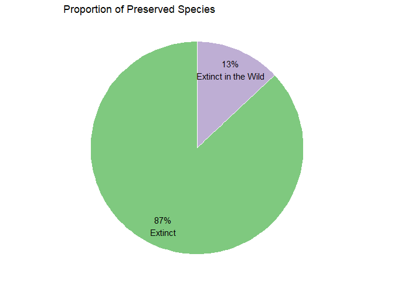

Extinct Plant Visualization
---------------------------

The International Union for Conservation of Nature (IUCN) collects data
on plants thought to be extinct. The data include 500 species that are
either extinct or extinct in the wild. Those species extinct in the wild
are still in cultivation centers such as botanical gardens.

There are 65 (13%) extinct in wild species and these may be considered
‘preserved’.

This visualization highlights the proportion of preserved species.

Heatmaps
--------

The objective is to show which plant groups are extinct and what
proportion of them are preserved by continent.

The heatmap uses color to show which plant groups have an extinction by
country of origin. The percent value shows what proportion of plant
species have been preserved.

**The proportion of extinct plant species still in cultivation centers
such as botanical gardens**

Observations

-   Flowering plants are observed as extinct across all continents and
    many of these are preserved in some way
-   **Cycads** are more prominent in South Africa with 50% of extinct
    species cultivated in conservation centers
-   Bermuda is preserving **ferns**

Chi Squared Test
----------------

A chi-square test can show if there is an even preservation result
across plant groups. The table of chi-squared residuals highlights that,

-   Cycads, as a plant group, predominate the preserved extinct species
-   Mosses and algae species are perhaps underrepresented as a preserved
    group

Observed
<table class="table" style="width: auto !important; margin-left: auto; margin-right: auto;">
<thead>
<tr>
<th style="text-align:left;">
</th>
<th style="text-align:right;">
Extinct
</th>
<th style="text-align:right;">
Extinct in the Wild
</th>
</tr>
</thead>
<tbody>
<tr>
<td style="text-align:left;">
Algae
</td>
<td style="text-align:right;">
3
</td>
<td style="text-align:right;">
0
</td>
</tr>
<tr>
<td style="text-align:left;">
Conifer
</td>
<td style="text-align:right;">
1
</td>
<td style="text-align:right;">
0
</td>
</tr>
<tr>
<td style="text-align:left;">
Cycad
</td>
<td style="text-align:right;">
4
</td>
<td style="text-align:right;">
4
</td>
</tr>
<tr>
<td style="text-align:left;">
Ferns
</td>
<td style="text-align:right;">
12
</td>
<td style="text-align:right;">
1
</td>
</tr>
<tr>
<td style="text-align:left;">
Flower
</td>
<td style="text-align:right;">
411
</td>
<td style="text-align:right;">
60
</td>
</tr>
<tr>
<td style="text-align:left;">
Mosses
</td>
<td style="text-align:right;">
4
</td>
<td style="text-align:right;">
0
</td>
</tr>
</tbody>
</table>
Expected
<table class="table" style="width: auto !important; margin-left: auto; margin-right: auto;">
<thead>
<tr>
<th style="text-align:left;">
</th>
<th style="text-align:right;">
Extinct
</th>
<th style="text-align:right;">
Extinct in the Wild
</th>
</tr>
</thead>
<tbody>
<tr>
<td style="text-align:left;">
Algae
</td>
<td style="text-align:right;">
2.61
</td>
<td style="text-align:right;">
0.39
</td>
</tr>
<tr>
<td style="text-align:left;">
Conifer
</td>
<td style="text-align:right;">
0.87
</td>
<td style="text-align:right;">
0.13
</td>
</tr>
<tr>
<td style="text-align:left;">
Cycad
</td>
<td style="text-align:right;">
6.96
</td>
<td style="text-align:right;">
1.04
</td>
</tr>
<tr>
<td style="text-align:left;">
Ferns
</td>
<td style="text-align:right;">
11.31
</td>
<td style="text-align:right;">
1.69
</td>
</tr>
<tr>
<td style="text-align:left;">
Flower
</td>
<td style="text-align:right;">
409.77
</td>
<td style="text-align:right;">
61.23
</td>
</tr>
<tr>
<td style="text-align:left;">
Mosses
</td>
<td style="text-align:right;">
3.48
</td>
<td style="text-align:right;">
0.52
</td>
</tr>
</tbody>
</table>
Residuals
<table class="table" style="width: auto !important; margin-left: auto; margin-right: auto;">
<thead>
<tr>
<th style="text-align:left;">
</th>
<th style="text-align:right;">
Extinct
</th>
<th style="text-align:right;">
Extinct in the Wild
</th>
</tr>
</thead>
<tbody>
<tr>
<td style="text-align:left;">
Algae
</td>
<td style="text-align:right;">
0.241
</td>
<td style="text-align:right;">
-0.624
</td>
</tr>
<tr>
<td style="text-align:left;">
Conifer
</td>
<td style="text-align:right;">
0.139
</td>
<td style="text-align:right;">
-0.361
</td>
</tr>
<tr>
<td style="text-align:left;">
Cycad
</td>
<td style="text-align:right;">
-1.122
</td>
<td style="text-align:right;">
2.903
</td>
</tr>
<tr>
<td style="text-align:left;">
Ferns
</td>
<td style="text-align:right;">
0.205
</td>
<td style="text-align:right;">
-0.531
</td>
</tr>
<tr>
<td style="text-align:left;">
Flower
</td>
<td style="text-align:right;">
0.061
</td>
<td style="text-align:right;">
-0.157
</td>
</tr>
<tr>
<td style="text-align:left;">
Mosses
</td>
<td style="text-align:right;">
0.279
</td>
<td style="text-align:right;">
-0.721
</td>
</tr>
</tbody>
</table>
% contribution to test statistic
<table class="table" style="width: auto !important; margin-left: auto; margin-right: auto;">
<thead>
<tr>
<th style="text-align:left;">
</th>
<th style="text-align:right;">
Extinct
</th>
<th style="text-align:right;">
Extinct in the Wild
</th>
</tr>
</thead>
<tbody>
<tr>
<td style="text-align:left;">
Algae
</td>
<td style="text-align:right;">
0.519
</td>
<td style="text-align:right;">
3.473
</td>
</tr>
<tr>
<td style="text-align:left;">
Conifer
</td>
<td style="text-align:right;">
0.173
</td>
<td style="text-align:right;">
1.158
</td>
</tr>
<tr>
<td style="text-align:left;">
Cycad
</td>
<td style="text-align:right;">
11.209
</td>
<td style="text-align:right;">
75.012
</td>
</tr>
<tr>
<td style="text-align:left;">
Ferns
</td>
<td style="text-align:right;">
0.375
</td>
<td style="text-align:right;">
2.508
</td>
</tr>
<tr>
<td style="text-align:left;">
Flower
</td>
<td style="text-align:right;">
0.033
</td>
<td style="text-align:right;">
0.220
</td>
</tr>
<tr>
<td style="text-align:left;">
Mosses
</td>
<td style="text-align:right;">
0.692
</td>
<td style="text-align:right;">
4.630
</td>
</tr>
</tbody>
</table>
