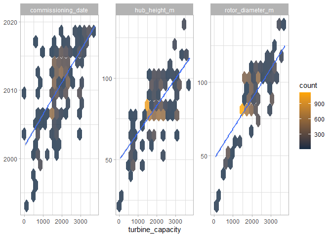
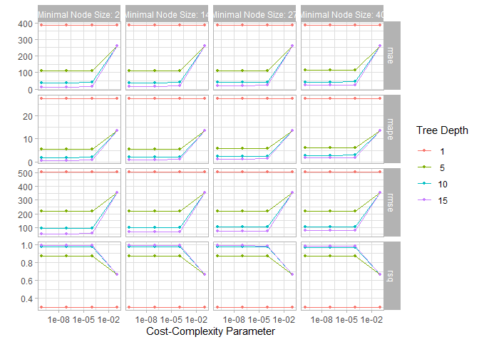
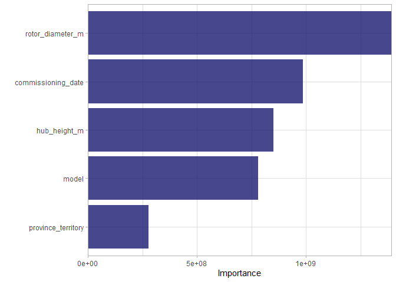
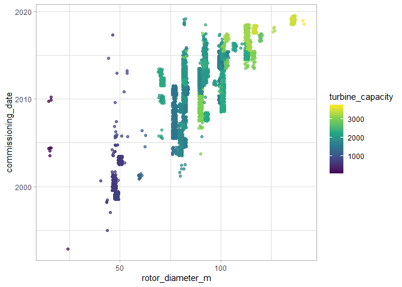
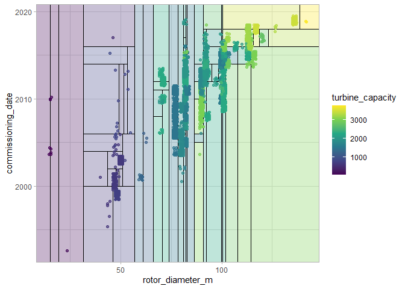
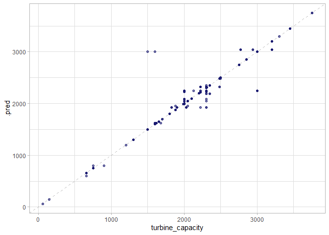

Predict turbine capacity
------------------------

Model Canadian wind turbine capacity with decision trees and tidymodels.

### Prep Data

``` r
turbines_df <- turbines %>% 
  transmute(turbine_capacity = turbine_rated_capacity_k_w,
            rotor_diameter_m,
            hub_height_m, 
            # parse_number to get the first number from a string, so '2014/2015' becomes 2014 
            commissioning_date = parse_number(commissioning_date), 
            #fct_lump_n lumps low frequency data into an 'other category'
            province_territory = fct_lump_n(province_territory,8),
            model = fct_lump_n(model,10)) %>%
  filter(!is.na(turbine_capacity)) %>%
  mutate_if(is.character, factor)
```

### Explore Data

Look at relationships between output and some variables. Using the
geom\_hex to help with overplotting…

``` r
turbines_df %>%
    select(turbine_capacity:commissioning_date) %>%
    pivot_longer(rotor_diameter_m:commissioning_date) %>%
    ggplot(aes(turbine_capacity, value)) +
    geom_hex(bins = 15, alpha = .8) + 
    geom_smooth(method="lm") +
    facet_wrap(~name, scales = "free_y") +
    labs(y=NULL) + scale_fill_gradient(high = "orange")
```



### Building the Model

Setting up training, testing, and resampling data…

``` r
set.seed(123)
wind_split <- initial_split(turbines_df, strata=turbine_capacity)
wind_train <- training(wind_split)
wind_test <- testing(wind_split)

#Make re-samples to tune the model...

set.seed(234)
wind_folds <- vfold_cv(wind_train, strata = turbine_capacity)
wind_folds
```

    ## #  10-fold cross-validation using stratification 
    ## # A tibble: 10 x 2
    ##    splits             id    
    ##    <list>             <chr> 
    ##  1 <split [4.4K/488]> Fold01
    ##  2 <split [4.4K/487]> Fold02
    ##  3 <split [4.4K/486]> Fold03
    ##  4 <split [4.4K/486]> Fold04
    ##  5 <split [4.4K/486]> Fold05
    ##  6 <split [4.4K/486]> Fold06
    ##  7 <split [4.4K/486]> Fold07
    ##  8 <split [4.4K/486]> Fold08
    ##  9 <split [4.4K/485]> Fold09
    ## 10 <split [4.4K/484]> Fold10

Decision tree specification and parameters

``` r
# Decision tree w/ three main tuning parameters 
# 1. How complicated
# 2. Tree depth - how many nodes
# 3. How many data points splitting nodes 

tree_spec <- decision_tree(
  cost_complexity = tune(),
  tree_depth = tune(),
  min_n = tune()
) %>%
  set_engine("rpart") %>%
  set_mode("regression")

tree_spec
```

    ## Decision Tree Model Specification (regression)
    ## 
    ## Main Arguments:
    ##   cost_complexity = tune()
    ##   tree_depth = tune()
    ##   min_n = tune()
    ## 
    ## Computational engine: rpart

``` r
tree_grid <- grid_regular(cost_complexity(), tree_depth(), min_n(), levels=4)

tree_grid
```

    ## # A tibble: 64 x 3
    ##    cost_complexity tree_depth min_n
    ##              <dbl>      <int> <int>
    ##  1    0.0000000001          1     2
    ##  2    0.0000001             1     2
    ##  3    0.0001                1     2
    ##  4    0.1                   1     2
    ##  5    0.0000000001          5     2
    ##  6    0.0000001             5     2
    ##  7    0.0001                5     2
    ##  8    0.1                   5     2
    ##  9    0.0000000001         10     2
    ## 10    0.0000001            10     2
    ## # ... with 54 more rows

Running the model and storing the results…

``` r
set.seed(345)

# Tree Results...
tree_rs <- tune_grid(
  tree_spec,
  turbine_capacity ~ .,
  resamples = wind_folds,
  grid = tree_grid,
  metrics = metric_set(rmse,rsq,mae,mape)
)

tree_rs
```

    ## # Tuning results
    ## # 10-fold cross-validation using stratification 
    ## # A tibble: 10 x 4
    ##    splits             id     .metrics           .notes          
    ##    <list>             <chr>  <list>             <list>          
    ##  1 <split [4.4K/488]> Fold01 <tibble [256 x 7]> <tibble [0 x 1]>
    ##  2 <split [4.4K/487]> Fold02 <tibble [256 x 7]> <tibble [0 x 1]>
    ##  3 <split [4.4K/486]> Fold03 <tibble [256 x 7]> <tibble [0 x 1]>
    ##  4 <split [4.4K/486]> Fold04 <tibble [256 x 7]> <tibble [0 x 1]>
    ##  5 <split [4.4K/486]> Fold05 <tibble [256 x 7]> <tibble [0 x 1]>
    ##  6 <split [4.4K/486]> Fold06 <tibble [256 x 7]> <tibble [0 x 1]>
    ##  7 <split [4.4K/486]> Fold07 <tibble [256 x 7]> <tibble [0 x 1]>
    ##  8 <split [4.4K/486]> Fold08 <tibble [256 x 7]> <tibble [0 x 1]>
    ##  9 <split [4.4K/485]> Fold09 <tibble [256 x 7]> <tibble [0 x 1]>
    ## 10 <split [4.4K/484]> Fold10 <tibble [256 x 7]> <tibble [0 x 1]>

Exploring model results,

``` r
# Tabular list of measure results...
collect_metrics(tree_rs)
```

    ## # A tibble: 256 x 9
    ##    cost_complexity tree_depth min_n .metric .estimator    mean     n std_err
    ##              <dbl>      <int> <int> <chr>   <chr>        <dbl> <int>   <dbl>
    ##  1    0.0000000001          1     2 mae     standard   386.       10  1.50  
    ##  2    0.0000000001          1     2 mape    standard    27.7      10  1.30  
    ##  3    0.0000000001          1     2 rmse    standard   508.       10  1.44  
    ##  4    0.0000000001          1     2 rsq     standard     0.303    10  0.0134
    ##  5    0.0000001             1     2 mae     standard   386.       10  1.50  
    ##  6    0.0000001             1     2 mape    standard    27.7      10  1.30  
    ##  7    0.0000001             1     2 rmse    standard   508.       10  1.44  
    ##  8    0.0000001             1     2 rsq     standard     0.303    10  0.0134
    ##  9    0.0001                1     2 mae     standard   386.       10  1.50  
    ## 10    0.0001                1     2 mape    standard    27.7      10  1.30  
    ## # ... with 246 more rows, and 1 more variable: .config <chr>

``` r
# Graphical view...
autoplot(tree_rs) + theme_light()
```



``` r
# Show the best models (default measure = rmse)
show_best(tree_rs)
```

    ## # A tibble: 5 x 9
    ##   cost_complexity tree_depth min_n .metric .estimator  mean     n std_err
    ##             <dbl>      <int> <int> <chr>   <chr>      <dbl> <int>   <dbl>
    ## 1    0.0000000001         15     2 rmse    standard    52.4    10    5.08
    ## 2    0.0000001            15     2 rmse    standard    52.4    10    5.09
    ## 3    0.0001               15     2 rmse    standard    55.9    10    4.51
    ## 4    0.0000000001         15    14 rmse    standard    64.4    10    4.16
    ## 5    0.0000001            15    14 rmse    standard    64.4    10    4.17
    ## # ... with 1 more variable: .config <chr>

``` r
# Select the best model (only one model returned) 
select_best(tree_rs, "rmse")
```

    ## # A tibble: 1 x 4
    ##   cost_complexity tree_depth min_n .config              
    ##             <dbl>      <int> <int> <chr>                
    ## 1    0.0000000001         15     2 Preprocessor1_Model13

Finalize the model using the best model based on rsme

``` r
# A tree specification with the values from the best model - as opposed to the above where the values were determined by tune() 

final_tree <- finalize_model(tree_spec, select_best(tree_rs, "rmse"))

# Fit the data to the model,

# fit to the training data. A fitted decision tree...

final_fit <- fit(final_tree, turbine_capacity ~., wind_train)

# Or use last_fit, which uses the split data instead of the training data. It fits to the training data and is evaluated on the test data...  
final_rs <- last_fit(final_tree, turbine_capacity ~., wind_split)
```

Predicting on new data

``` r
# use this as 'new data' to predict with,
wind_train[44,]
```

    ## # A tibble: 1 x 6
    ##   turbine_capacity rotor_diameter_m hub_height_m commissioning_d~
    ##              <dbl>            <dbl>        <dbl>            <dbl>
    ## 1              660               50           47             2003
    ## # ... with 2 more variables: province_territory <fct>, model <fct>

``` r
predict(final_fit, wind_train[44,])
```

    ## # A tibble: 1 x 1
    ##   .pred
    ##   <dbl>
    ## 1   660

``` r
# Or use final_rs...

predict(final_rs$.workflow[[1]], wind_train[44,])
```

    ## # A tibble: 1 x 1
    ##   .pred
    ##   <dbl>
    ## 1   660

### Understanding the model

``` r
# Plot the variables by importance... 

final_fit %>% 
  vip(geom="col", aesthetics = list(fill="midnightblue", alpha=.8)) +
  scale_y_continuous(expand = c(0,0))
```



``` r
# You can also Visualize the tree partitions on the data when looking at one or two variables. Here is an example with two predictors...

# here is the data for the two predictors...

wind_train %>% 
  ggplot(aes(rotor_diameter_m, commissioning_date)) +
  geom_jitter(alpha=.7, width = 1, height = .5, aes(color = turbine_capacity)) +
  scale_color_viridis_c(aesthetics = c("color", "fill"))
```



``` r
# Create another fit for this purpose that only has the two predictors

ex_fit <- fit(final_tree, turbine_capacity ~ rotor_diameter_m + commissioning_date, wind_train)

# Now add the geom_parttree layer,

wind_train %>% 
  ggplot(aes(rotor_diameter_m, commissioning_date)) +
  geom_parttree(data = ex_fit, aes(fill = turbine_capacity), alpha=.3) +
  geom_jitter(alpha=.7, width = 1, height = .5, aes(color = turbine_capacity)) +
  scale_color_viridis_c(aesthetics = c("color", "fill"))
```



This chart shows how the partitions that the decision tree is using to
make predictions.

### Testing Data Outcomes

``` r
# Results from the testing data...

collect_metrics(final_rs)
```

    ## # A tibble: 2 x 4
    ##   .metric .estimator .estimate .config             
    ##   <chr>   <chr>          <dbl> <chr>               
    ## 1 rmse    standard      73.6   Preprocessor1_Model1
    ## 2 rsq     standard       0.985 Preprocessor1_Model1

``` r
# The predicted and true capacity... 
collect_predictions(final_rs)
```

    ## # A tibble: 1,618 x 5
    ##    id               .pred  .row turbine_capacity .config             
    ##    <chr>            <dbl> <int>            <dbl> <chr>               
    ##  1 train/test split  1300     8             1300 Preprocessor1_Model1
    ##  2 train/test split  1300    10             1300 Preprocessor1_Model1
    ##  3 train/test split  1300    11             1300 Preprocessor1_Model1
    ##  4 train/test split  1300    13             1300 Preprocessor1_Model1
    ##  5 train/test split  1300    16             1300 Preprocessor1_Model1
    ##  6 train/test split  1300    19             1300 Preprocessor1_Model1
    ##  7 train/test split  1300    24             1300 Preprocessor1_Model1
    ##  8 train/test split  1300    26             1300 Preprocessor1_Model1
    ##  9 train/test split   660    32              660 Preprocessor1_Model1
    ## 10 train/test split   660    35              660 Preprocessor1_Model1
    ## # ... with 1,608 more rows

``` r
# Chart actual and predicted values...

collect_predictions(final_rs) %>%
  ggplot(aes(turbine_capacity, .pred)) +
  geom_abline(slope=1, lty=2, color = "grey50", alpha=.5)+
  geom_point(alpha=.6, color = "midnightblue")
```


