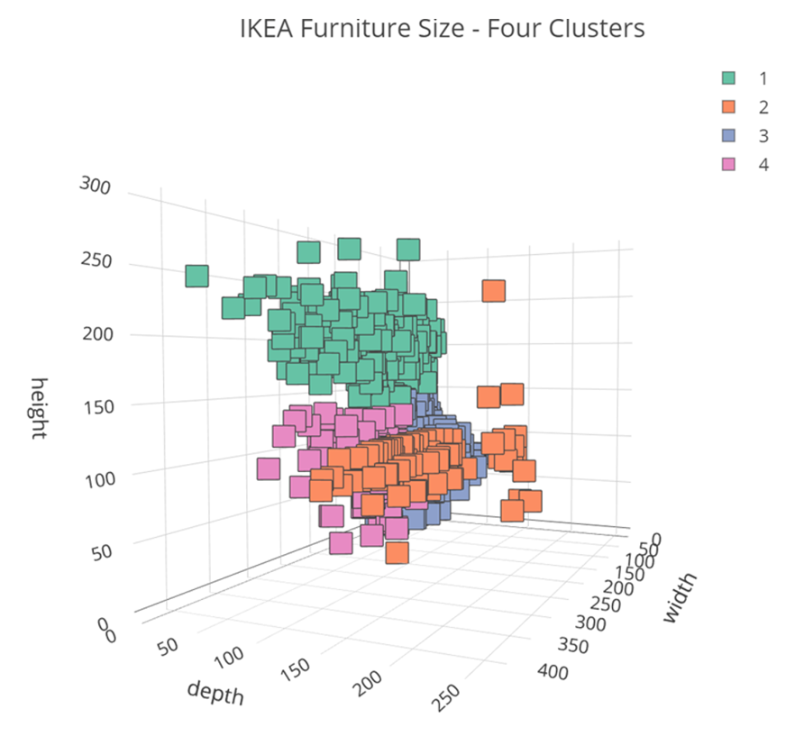
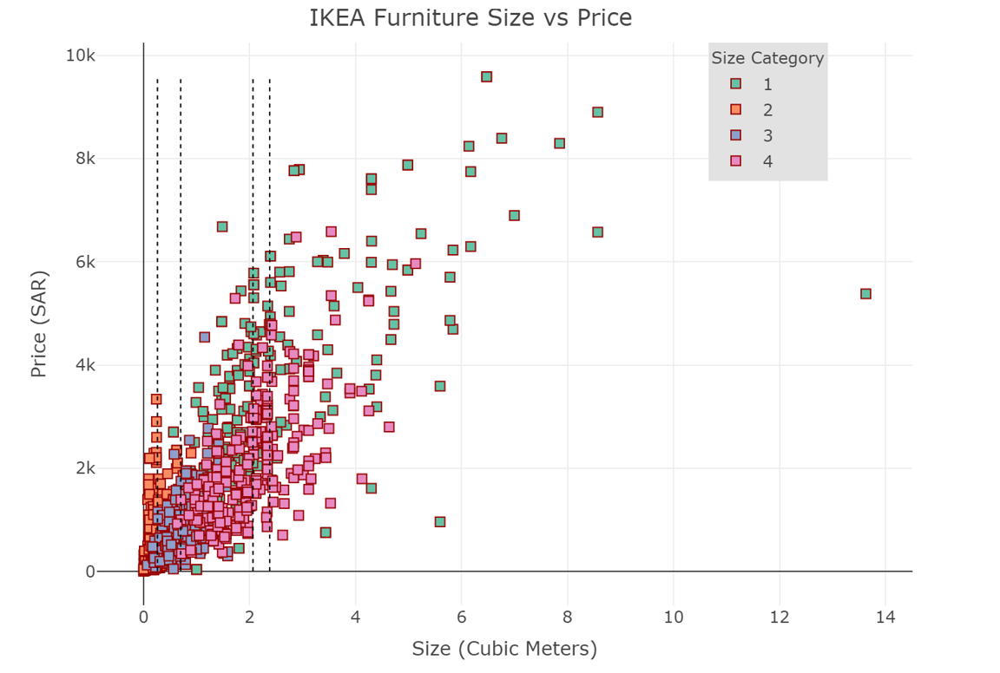
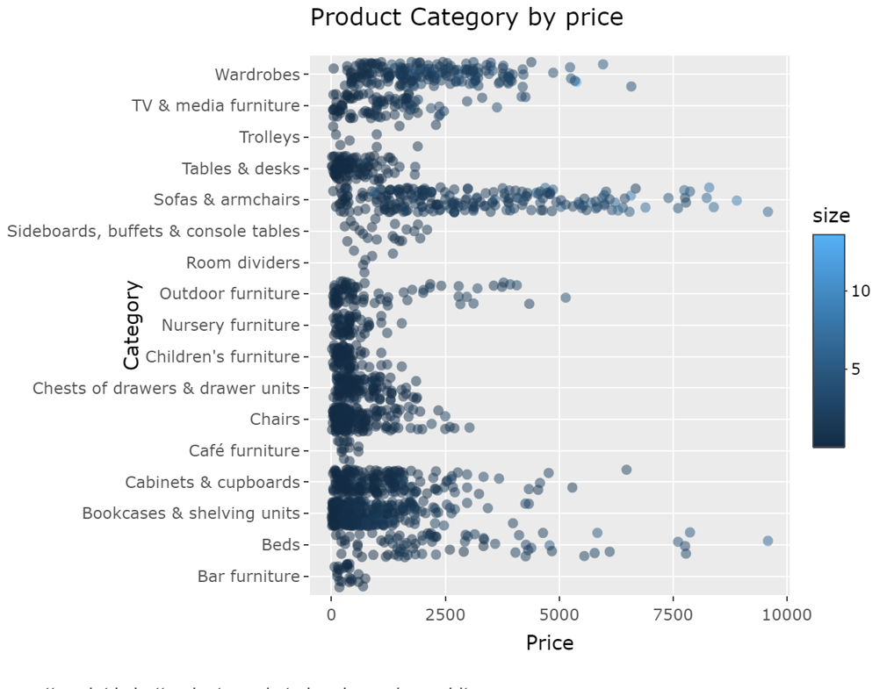
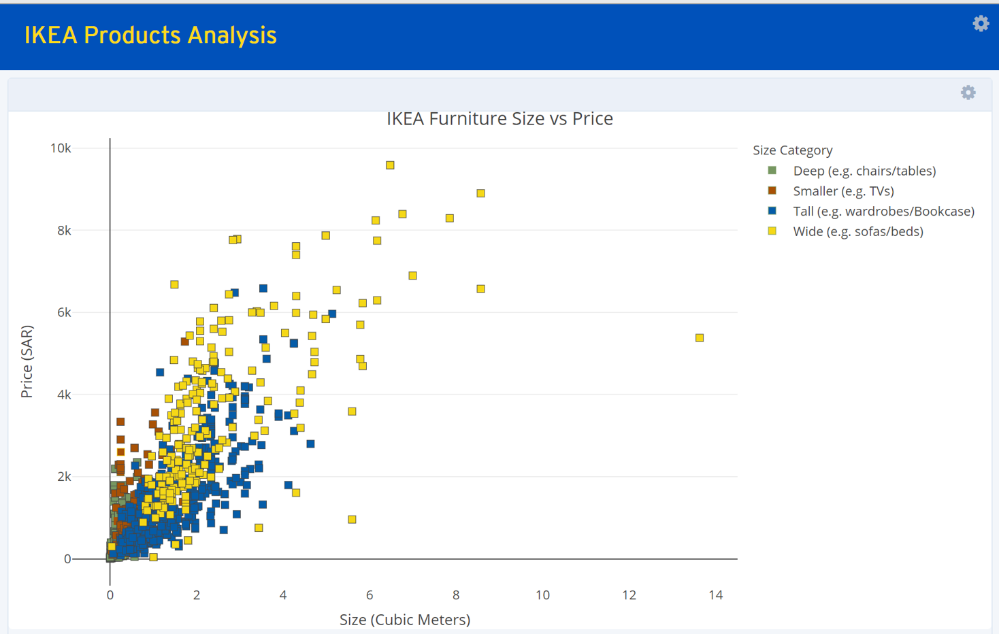

Some data cleaning from the initial exploratory analysis.

``` r
# Clean up the Designer column
## Remove 'IKEA of Sweden/' and '/IKEA of Sweden'
ikea$designer <- ikea$designer %>% str_remove("/IKEA of Sweden")
ikea$designer <- ikea$designer %>% str_remove("IKEA of Sweden/")

## Remove designers that have a character length over 39 (they are not names)
ikea <- ikea %>% mutate(len = nchar(designer)) %>% filter(len < 40)

## Remove rows that have an NA in either width, depth, or height...
ikea <- ikea %>% drop_na(c("width", "height", "depth"))

## Get the top x designers by product count
top <- 10
topDesigners <- ikea %>% group_by(designer) %>% summarize(n=n()) %>% arrange(desc(n)) %>% slice_head(n=top)

## Add top 20 designers to the main table. 
ikea <- ikea %>% left_join(topDesigners, by="designer")# %>% filter(n>0)
```

Using the product dimensions (width, height, depth), perform a k-means
cluster analysis to see what are the common grouped sizes of products.
Trying group sizes from three to six and visualizaing with a 3d
scatterplot

``` r
## Find clusters in product dimensions using k-means...
ikea <- ikea %>% mutate(widthS = scale(width), heightS = scale(height), depthS=scale(depth))

ikea$cluster3 <- kmeans(ikea[,c("widthS", "heightS", "depthS")],3)$cluster
ikea$cluster4 <- kmeans(ikea[,c("widthS", "heightS", "depthS")],4)$cluster
ikea$cluster5 <- kmeans(ikea[,c("widthS", "heightS", "depthS")],5)$cluster
ikea$cluster6 <- kmeans(ikea[,c("widthS", "heightS", "depthS")],6)$cluster

#ikea %>% plot_ly(x=~width, y=~depth, z=~height, color=as.factor(ikea$cluster4), marker=list(symbol = "square"))

table(ikea[,c("category", "cluster4")])
```

    ##                                       cluster4
    ## category                                 1   2   3   4
    ##   Bar furniture                          0   0  24   0
    ##   Beds                                  34  10  32   0
    ##   Bookcases & shelving units             1   2 153 211
    ##   Cabinets & cupboards                   0   1 112  79
    ##   Café furniture                         0   0  13   0
    ##   Chairs                                 2  47 151   1
    ##   Chests of drawers & drawer units       0   0 118   2
    ##   Children's furniture                   0   0  65   8
    ##   Nursery furniture                      0   3  47   7
    ##   Outdoor furniture                     14  31  29   2
    ##   Room dividers                          0   0   0   6
    ##   Sideboards, buffets & console tables   0   0  12   8
    ##   Sofas & armchairs                    134  65  19   0
    ##   Tables & desks                         1   8  80  10
    ##   Trolleys                               0   2   6   1
    ##   TV & media furniture                   1   1  48  39
    ##   Wardrobes                              1   0  13 181



Calculate product size by determining the how many cubic meters the
piece is (simply width \* height \* depth). Compare this to price. For
example, it could be that the larger the furniture, the more material
and handling costs, hence the higher the price.

Also, add average size line for each cluster

``` r
ikea <- ikea %>% mutate(size = (width/100)*(height/100)*(depth/100))

ClusterAvg <- ikea %>% group_by(cluster4) %>% summarize(a=mean(size))

#ikea %>% plot_ly(x = ~size, y = ~price, color = as.factor(ikea$cluster4),
#                 marker = list(symbol="square", size = 7,
#                               line = list(color = 'rgba(152, 0, 0, .95)', width = 1))) %>% 
#    layout(shapes=list(list(type='line', x0= ClusterAvg[1,]$a, x1= ClusterAvg[1,]$a, y0=min(ikea$price), y1=max(ikea$price), line=list(dash='dot', width=1)), list(type='line', x0= ClusterAvg[2,]$a, x1= ClusterAvg[2,]$a, y0=min(ikea$price), y1=max(ikea$price), line=list(dash='dot', width=1)), list(type='line', x0= ClusterAvg[3,]$a, x1= ClusterAvg[3,]$a, y0=min(ikea$price), y1=max(ikea$price), line=list(dash='dot', width=1)), list(type='line', x0= ClusterAvg[4,]$a, x1= ClusterAvg[4,]$a, y0=min(ikea$price), y1=max(ikea$price), line=list(dash='dot', width=1))), legend = list(x=.75, y=1,bgcolor = "#E2E2E2", title=list(text='Size Category')),title = "IKEA Furniture Size vs Price", yaxis = list(zeroline = TRUE, title="Price (SAR)"),xaxis = list(zeroline = TRUE, title="Size (Cubic Meters)"))
```



The average size lines make the plot too busy… How about looking at
product category by size and price,

``` r
# Make plot,

catPlot2 <- ggplot(ikea,aes(x=price, y=category, colour=size)) +
    geom_jitter(aes(text=paste("Name: ", name)), width=0.25, alpha=0.5, ) +
    labs(title = "Product Category by price",
         x = "Price",
         y = "Category")

#    ggplotly(catPlot2)
```



The scatter plot is better, just needs to be cleaned up a bit…

``` r
ikea <- ikea %>% mutate(clusterName = 
                  case_when(
                    cluster4 == 1 ~ "Tall (e.g. wardrobes/Bookcase)", 
                    cluster4 == 2 ~ "Wide (e.g. sofas/beds)", 
                    cluster4 == 3 ~ "Deep (e.g. chairs/tables)", 
                    cluster4 == 4 ~ "Smaller (e.g. TVs)", TRUE ~ "" ))

pal <- c("#779761",  "#A85105", "#055CA8", "#F5D817")    

sizePlot2 <- ikea %>% plot_ly(x = ~size, y = ~price, color = as.factor(ikea$clusterName), colors=pal,
                 text = paste("Item: ", ikea$name, "<br>Category :", ikea$category, "<br>Price:", ikea$price, "<br>Width: ", ikea$width,"<br>Height: ", ikea$height, "<br>Depth: ", ikea$depth, "<br>Shape:", ikea$clusterName),
                 marker = list(symbol="square", size = 7, line = list(color = pal, width = .5))) %>% 
    layout(
        legend = list(bgcolor = "#FFFFFF", title=list(text='Size Category')),
        title = "IKEA Furniture Size vs Price", 
        yaxis = list(zeroline = TRUE, title="Price (SAR)"),
        xaxis = list(showgrid = FALSE, zeroline = TRUE, title="Size (Cubic Meters)"))

#sizePlot2
```


