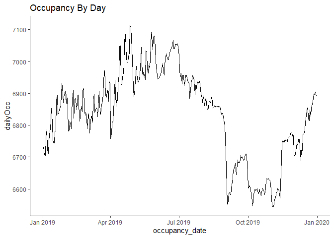
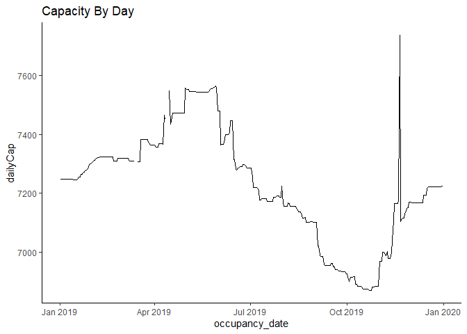
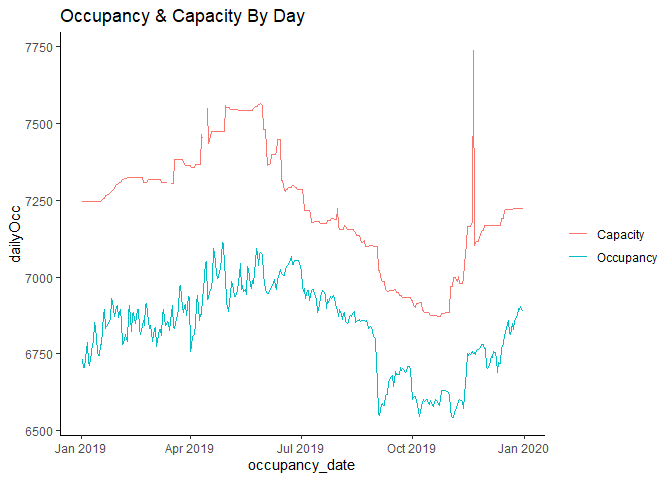
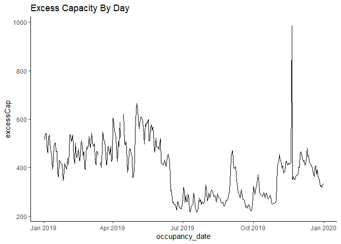
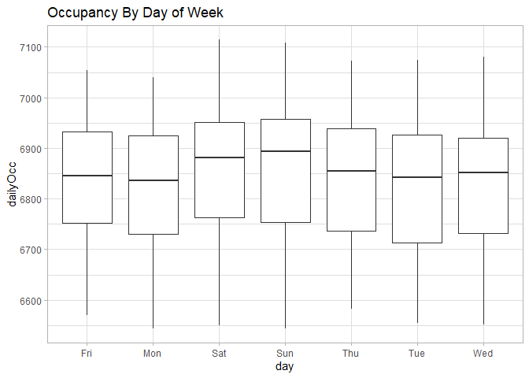
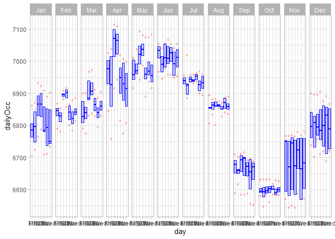
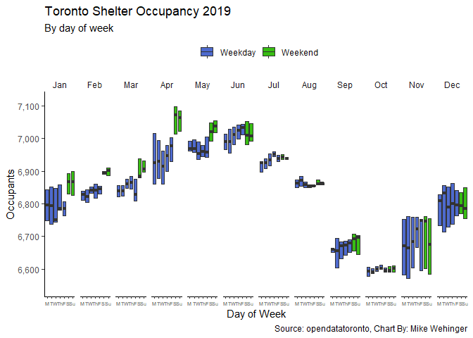

Exploring Toronto Shelter Data
------------------------------

**QUESTION**: Are shelters busier on certain days, like the weekend?

First, look only at 2019 and count all shelters and sectors. Here is how
to set up the data…

``` r
shelterDaily <- shelters %>% filter(occupancy_date > "2019-1-1") %>% group_by(occupancy_date) %>% summarize(dailyOcc = sum(occupancy), dailyCap = sum(capacity)) %>% mutate(excessCap = dailyCap - dailyOcc)

#shelterDaily$day <- as.factor(weekdays(as.Date(shelterDaily$occupancy_date)))
shelterDaily$month <- as.factor(format(shelterDaily$occupancy_date,"%b"))
shelterDaily$day <- as.factor(format(shelterDaily$occupancy_date,"%a"))

shelterDaily <- shelterDaily %>% mutate(d=ifelse(day=="Thu" | day=="Sun", substr(day,1,2), substr(day,1,1)))

shelterDaily$d <- factor(shelterDaily$d, levels=c("M", "T", "W", "Th", "F", "S", "Su"))

shelterDaily <- shelterDaily %>% mutate(we = ifelse(d=="S" | d=="Su","Weekend","Weekday"))

shelterDaily$month <- factor(shelterDaily$month, levels=c("Jan", "Feb", "Mar", "Apr", "May", "Jun", "Jul", "Aug", "Sep", "Oct", "Nov", "Dec"))
```

Let’s look at the occupancy each day of the year…

Notes

-   Occupancy and capacity seem correlated, for example, people will
    occupy the space available

-   There seems to be relatively more excess capacity at the beginning
    of the year

``` r
ggplot(data=shelterDaily, aes(x=occupancy_date, y=dailyOcc)) +
    geom_line()+ theme_classic() + labs(title = "Occupancy By Day")
```



``` r
ggplot(data=shelterDaily, aes(x=occupancy_date, y=dailyCap)) +
    geom_line()+ theme_classic() + labs(title = "Capacity By Day")
```



``` r
ggplot(shelterDaily, aes(x=occupancy_date)) + 
    geom_line(aes(y=dailyOcc, color="Occupancy")) +
    geom_line(aes(y=dailyCap, color="Capacity")) + 
    labs(color="",title = "Occupancy & Capacity By Day")+ theme_classic()
```



``` r
ggplot(data=shelterDaily, aes(x=occupancy_date, y=excessCap)) +
    geom_line()+ theme_classic() + labs(title = "Excess Capacity By Day")
```



Now, look at occupancy for each day of the week…

Notes

-   Saturday and Sunday are higher than the other days
-   We lose the variation throughout the year that was evident in the
    above line charts

``` r
ggplot(shelterDaily, aes(x=day, y=dailyOcc)) +
    geom_boxplot() + ggtitle("Occupancy By Day of Week") + theme_light()
```



Let’s facet the boxplot by month and see how that looks,

``` r
ggplot(shelterDaily, aes(x=day, y=dailyOcc)) + 
    geom_boxplot(
        
        # custom boxes
        color="blue",
        fill="blue",
        alpha=0.2,
        
        coef = 0,
        # custom outliers
        outlier.colour="red",
        outlier.fill="red",
        outlier.size=1
        
    ) + facet_grid(. ~ month)+ theme_light()
```



That looks good - now to clean up the chart and pick colors (highlight
the weekend)

``` r
ggplot(shelterDaily, aes(x=d, y=dailyOcc, fill=we, alpha=we)) + 
    geom_boxplot(
        coef = 0,
        fatten = 3,
        outlier.shape = NA) + 
  facet_grid(. ~ month) + 
  scale_fill_manual(values=c("#1338BE", "#38BE13")) +
  scale_alpha_manual(values=c(.75,1)) + 
  theme_classic() + 
  theme(strip.background = element_rect(
        color="white", fill="white", size=0, linetype="solid"), 
        axis.text.x = element_text(size=5)) +
  scale_y_continuous(label=comma) + 
  labs(title = "Toronto Shelter Occupancy 2019", subtitle = "By day of week", x="Day of Week", y="Occupants", caption = "Source: opendatatoronto, Chart By: Mike Wehinger") + 
  theme(legend.position = "top", legend.title = element_blank())
```



The chart shows for each day of the week, how many occupants were housed
in Toronto shelters. The bars show the interquartile range and median
number of people occupying all shelters
