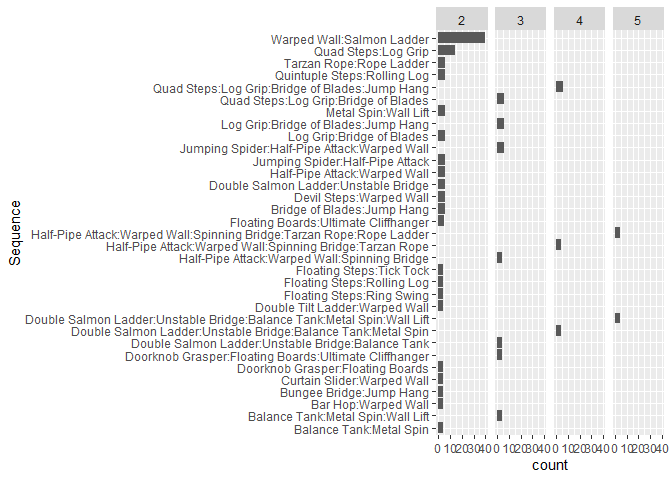
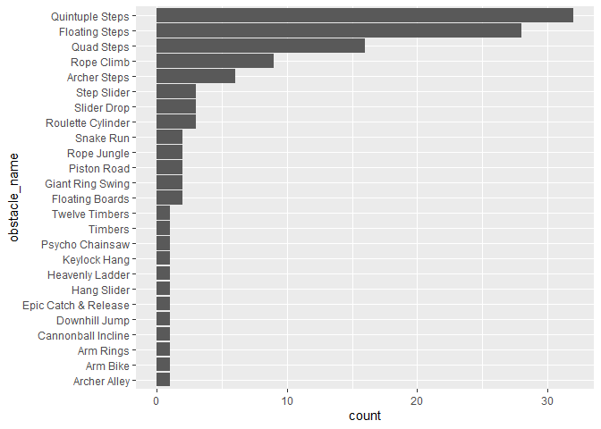
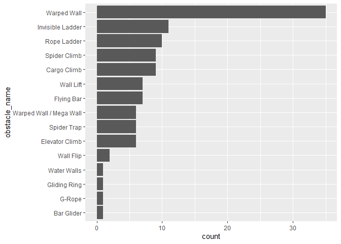
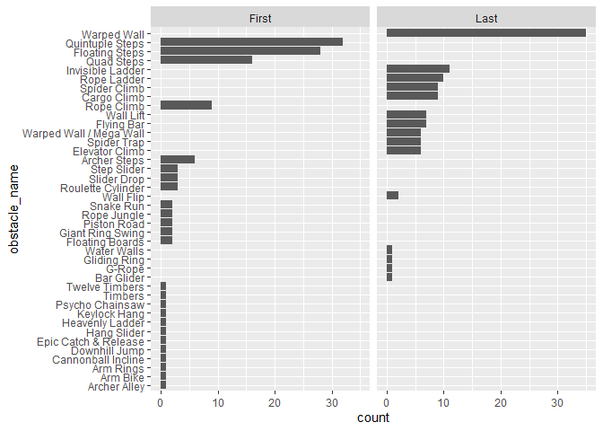
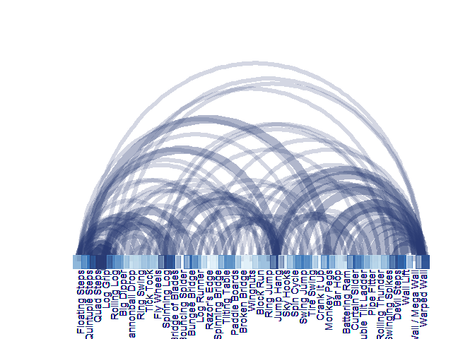
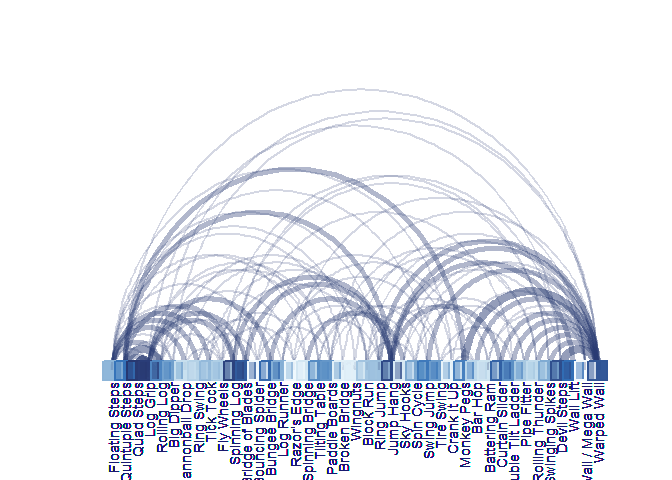
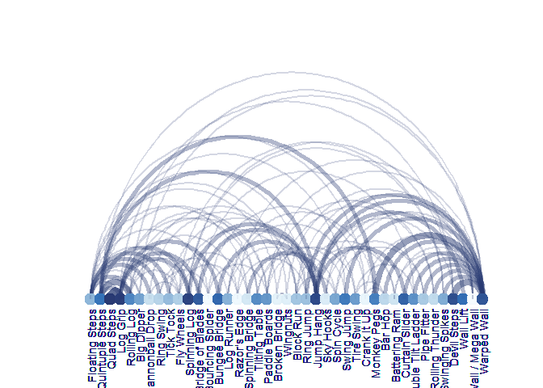

Ninja Warrior Obstacle Analysis
-------------------------------

This dataset includes every obstacle in the history of American Ninja
Warrior from season 1 to 10.

**Sasuke:** Seasons 1 to 3 are known as Sasuke where the top 10
competitors went to Sasuke to compete

**NBC Era** Starting in season 4 when the show took on the regional/city
formats with National Finals in Las Vegas

Here is some exploratory analysis

``` r
# First look at how many obstacles are in each show... 

#kable(
  ninja %>% 
    group_by(location, round_stage) %>% 
    summarize(min = min(obstacle_order), max = max(obstacle_order)) %>%
    mutate(obstacle_count = paste(min, " to ", max, sep="")) %>%
    group_by(obstacle_count) %>% summarize(count = n()) %>%
    arrange(desc(count))
```

    ## # A tibble: 7 x 2
    ##   obstacle_count count
    ##   <chr>          <int>
    ## 1 1 to 6            29
    ## 2 1 to 10           22
    ## 3 1 to 9             9
    ## 4 1 to 7             4
    ## 5 1 to 1             3
    ## 6 1 to 8             2
    ## 7 1 to 2             1

``` r
#  ) %>% kable_styling(latex_options = "striped", full_width = FALSE)

#kable(
  ninja %>% 
    filter(round_stage == "Qualifying (Regional/City)") %>%
    group_by(location, round_stage) %>% 
    summarize(min = min(obstacle_order), max = max(obstacle_order)) %>%
    mutate(obstacle_count = paste(min, " to ", max, sep=""))
```

    ## # A tibble: 26 x 5
    ## # Groups:   location [26]
    ##    location      round_stage                  min   max obstacle_count
    ##    <chr>         <chr>                      <dbl> <dbl> <chr>         
    ##  1 Atlanta       Qualifying (Regional/City)     1     6 1 to 6        
    ##  2 Baltimore     Qualifying (Regional/City)     1     6 1 to 6        
    ##  3 Cleveland     Qualifying (Regional/City)     1     6 1 to 6        
    ##  4 Dallas        Qualifying (Regional/City)     1     6 1 to 6        
    ##  5 Daytona Beach Qualifying (Regional/City)     1     6 1 to 6        
    ##  6 Denver        Qualifying (Regional/City)     1     6 1 to 6        
    ##  7 Houston       Qualifying (Regional/City)     1     6 1 to 6        
    ##  8 Indianapolis  Qualifying (Regional/City)     1     6 1 to 6        
    ##  9 Kansas City   Qualifying (Regional/City)     1     6 1 to 6        
    ## 10 Los Angeles   Qualifying (Regional/City)     1     6 1 to 6        
    ## # ... with 16 more rows

``` r
#  ) %>% kable_styling(latex_options = "striped", full_width = FALSE)

# counts by obstacle name,

print(paste("There are ", ninja$obstacle_name %>% n_distinct(), " unique obstacle names", sep=""))
```

    ## [1] "There are 225 unique obstacle names"

``` r
print(paste("There are ", ninja %>% filter(round_stage == "Qualifying (Regional/City)") %>% select(obstacle_name) %>% n_distinct(), " unique obstacle names in the Qualifying (Regional/City) rounds", sep=""))
```

    ## [1] "There are 98 unique obstacle names in the Qualifying (Regional/City) rounds"

``` r
# Most used obstacles...

#kable(
  ninja %>% 
    group_by(obstacle_name) %>%
    summarize(count = n(), percentofEvents = (n()/122)*100) %>% 
    arrange(desc(count)) %>%
    slice_head(n = 20)
```

    ## # A tibble: 20 x 3
    ##    obstacle_name        count percentofEvents
    ##    <chr>                <int>           <dbl>
    ##  1 Warped Wall             86           70.5 
    ##  2 Salmon Ladder           41           33.6 
    ##  3 Quintuple Steps         32           26.2 
    ##  4 Floating Steps          28           23.0 
    ##  5 Log Grip                21           17.2 
    ##  6 Jump Hang               18           14.8 
    ##  7 Quad Steps              16           13.1 
    ##  8 Jumping Spider          14           11.5 
    ##  9 Invisible Ladder        11            9.02
    ## 10 Rolling Log             11            9.02
    ## 11 Wall Lift               11            9.02
    ## 12 Bridge of Blades        10            8.20
    ## 13 Rope Ladder             10            8.20
    ## 14 Cargo Climb              9            7.38
    ## 15 Rope Climb               9            7.38
    ## 16 Spider Climb             9            7.38
    ## 17 Ultimate Cliffhanger     9            7.38
    ## 18 Flying Bar               8            6.56
    ## 19 Jumping Bars             8            6.56
    ## 20 Spinning Bridge          8            6.56

``` r
#) %>% kable_styling(latex_options = "striped", full_width = FALSE)
```

Look at first and last obstacles

``` r
lastOb <- ninja %>% mutate(tempID = paste(season, location, round_stage, sep="_")) %>%
    group_by(tempID) %>% 
    summarize(max = max(obstacle_order))
```

Sequences of obstacles
----------------------

Most common sequences of obstacles

``` r
#ninja$pos <- ""
oseq <- data.frame(Sequence = "", id=0, seqLength=0)
for (i in 1:880) { #880 
   
  if(ninja[i, "obstacle_order"] == 1) {
    #This is the first obstacle in the series, mark this as a starting point
      start <- i
  }
  else {

    #We are after the start, so collect obstacle sequences
    
    oseq <- rbind(oseq, 
                  data.frame(
                    Sequence=paste(ninja[i-1, "obstacle_name"], ":",
                                   ninja[i, "obstacle_name"], sep=""), 
                    id=ninja[i, "id"], 
                    seqLength = 2))
    
    if( (i-2) >= start) {

          oseq <- rbind(oseq, 
                  data.frame(
                    Sequence=paste(ninja[i-2, "obstacle_name"], ":",
                                   ninja[i-1, "obstacle_name"], ":",
                                   ninja[i, "obstacle_name"], sep=""), 
                    id=ninja[i, "id"], 
                    seqLength = 3))
    }

        if( (i-3) >= start) {

          oseq <- rbind(oseq, 
                  data.frame(
                    Sequence=paste(ninja[i-3, "obstacle_name"], ":",
                                   ninja[i-2, "obstacle_name"], ":",
                                   ninja[i-1, "obstacle_name"], ":",
                                   ninja[i, "obstacle_name"], sep=""), 
                    id=ninja[i, "id"], 
                    seqLength = 4))
    }

            if( (i-4) >= start) {

          oseq <- rbind(oseq, 
                  data.frame(
                    Sequence=paste(ninja[i-4, "obstacle_name"], ":",
                                   ninja[i-3, "obstacle_name"], ":",
                                   ninja[i-2, "obstacle_name"], ":",
                                   ninja[i-1, "obstacle_name"], ":",
                                   ninja[i, "obstacle_name"], sep=""), 
                    id=ninja[i, "id"], 
                    seqLength = 5))
    }
  }

     if(ninja[i+1, "obstacle_order"] < ninja[i, "obstacle_order"]) {
    #This is the last obstacle in the series, 
     ninja[i,"pos"] <- "Last"
  }
  
}  

tbl <- oseq %>% group_by(Sequence) %>%
  summarize(count = n(), id=max(id), seqLength = max(seqLength)) %>%
  arrange(desc(count)) # %>% slice_head(n=33)

tbl$Sequence <- factor(tbl$Sequence, levels = tbl$Sequence[order(tbl$count)])

#kable(
tbl %>% slice_head(n=26)#) %>%
```

    ## # A tibble: 26 x 4
    ##    Sequence                                    count    id seqLength
    ##    <fct>                                       <int> <dbl>     <dbl>
    ##  1 Warped Wall:Salmon Ladder                      40   862         2
    ##  2 Quad Steps:Log Grip                            14   202         2
    ##  3 Bridge of Blades:Jump Hang                      6   188         2
    ##  4 Devil Steps:Warped Wall                         6   438         2
    ##  5 Double Salmon Ladder:Unstable Bridge            6   534         2
    ##  6 Half-Pipe Attack:Warped Wall                    6   408         2
    ##  7 Jumping Spider:Half-Pipe Attack                 6   407         2
    ##  8 Jumping Spider:Half-Pipe Attack:Warped Wall     6   408         3
    ##  9 Log Grip:Bridge of Blades                       6   187         2
    ## 10 Log Grip:Bridge of Blades:Jump Hang             6   188         3
    ## # ... with 16 more rows

``` r
#  kable_styling(bootstrap_options = "striped",
#                full_width = F)


tbl %>% slice_head(n=33) %>% ggplot(aes(x=Sequence, y=count)) +geom_bar(stat="identity") + coord_flip() + facet_grid(. ~ seqLength)
```



First & Last Obstacles
----------------------

``` r
FtoL <- ninja %>% 
  filter(pos=="Last" | obstacle_order==1) %>% 
  replace_na(list(pos = "First")) %>%
  group_by(obstacle_name, pos) %>%
  summarize(count = n()) %>%
  arrange(pos, desc(count))

FtoL$obstacle_name <- as.factor(FtoL$obstacle_name)

FtoL$obstacle_name <- factor(FtoL$obstacle_name, levels = FtoL$obstacle_name[order(FtoL$count)])

FtoL
```

    ## # A tibble: 40 x 3
    ## # Groups:   obstacle_name [40]
    ##    obstacle_name     pos   count
    ##    <fct>             <chr> <int>
    ##  1 Quintuple Steps   First    32
    ##  2 Floating Steps    First    28
    ##  3 Quad Steps        First    16
    ##  4 Rope Climb        First     9
    ##  5 Archer Steps      First     6
    ##  6 Roulette Cylinder First     3
    ##  7 Slider Drop       First     3
    ##  8 Step Slider       First     3
    ##  9 Floating Boards   First     2
    ## 10 Giant Ring Swing  First     2
    ## # ... with 30 more rows

``` r
FtoL %>% filter(pos=="First") %>% arrange(count) %>% slice_head(n=20) %>% ggplot(aes(x=obstacle_name, y=count)) +geom_bar(stat="identity") + coord_flip()
```



``` r
FtoL %>% filter(pos=="Last") %>% arrange(count) %>% slice_head(n=20) %>% ggplot(aes(x=obstacle_name, y=count)) +geom_bar(stat="identity") + coord_flip()
```



``` r
FtoL %>% arrange(count) %>% slice_head(n=20) %>% ggplot(aes(x=obstacle_name, y=count)) +geom_bar(stat="identity") + coord_flip()+ facet_grid(. ~ pos)
```



Network Diagram
---------------

A network diagram may be best. Filter the data down to Qualifying
episodes and try the arcplot…

``` r
# Prepare data for the arcplot

# The data will be composed to two elements, 
# 1. An edge list, which is a list of 'from' to 'to' obstacles
# 2. A node list - Each obstacle is a node and we want to calculate certain parameters, such as how often its used and in which order it typically appears...

# First, filter the data to just the Qualifying rounds that have six obstacles...
obstacles <- ninja %>% filter(round_stage == "Qualifying (Regional/City)")

# Then for each obstacle, add a column that shows how many times that obstacle has been used.
obstacles <- left_join(obstacles,obstacles %>% group_by(obstacle_name) %>% summarize(obsCount = n())) %>% filter(obsCount>1) 

# Initiate a dataframe that will collect data 
fin <- data.frame(obstacle_name=NULL, obstacle_nameD=NULL, pos=NULL, obsCount=NULL)

#Loop through obstacle data and make from to obstacles...

for (i in 1:172) {
  # Skip this step if we are on the last (number 6) obstacle
  if(obstacles[i,"obstacle_order"]<6){
    curr <- cbind(obstacles[i,"obstacle_name"],
                  obstacles[i+1,"obstacle_name"],
                  obstacles[i,"obstacle_order"],
                  obstacles[i,"obsCount"])
    
    fin <- rbind(fin, curr)    
  }

}

# Change the second col name to show its the destination 
colnames(fin)[2] <- "obstacle_nameD"

# Create a matrix for the 'to' from' obstacles...
edge <- as.matrix(fin[,1:2])

# Create a list of nodes and indicate their size and average position
nodes <- bind_rows(
  fin %>% 
    group_by(obstacle_name) %>% 
    summarize(pos = mean(obstacle_order), obsCount=max(obsCount)) %>%
    arrange(pos),
  fin %>% 
    group_by(obstacle_name = obstacle_nameD) %>% 
    summarize(pos = mean(obstacle_order)+1, obsCount=max(obsCount)) %>%
    arrange(pos))

nodes <- nodes %>% group_by(obstacle_name) %>% summarize(pos=first(pos), obsCount = first(obsCount)) %>% arrange(pos) %>% mutate(id = 1:41, id=ifelse(id<21, obsCount*-1,obsCount*1)) %>% arrange(pos, id)

#Create count of obstacle combos to determine line thickness..
thickness <- tibble(combos = paste(edge[,1],edge[,2], sep=" to ")) %>% left_join(tibble(combos = paste(edge[,1],edge[,2], sep=" to ")) %>% group_by(combos) %>% summarize(lwd = n()))

# Big Lines
arcplot(edge, ordering =  nodes$obstacle_name,
        col.arcs = hcl.colors(1, palette = "Blues", alpha = .2),
        lwd.arcs=thickness$lwd*6,
        show.nodes = TRUE,
        pch.nodes=22,
        cex.nodes=3,
        col.nodes=hcl.colors(41, palette = "Blues", alpha = .9),
        bg.nodes=hcl.colors(41, palette = "Blues", alpha = .2),
        lwd.nodes=1, col.labels = "midnightblue", cex.labels = .9)
```



``` r
# Smaller lines
arcplot(edge, ordering =  nodes$obstacle_name,
        col.arcs = hcl.colors(1, palette = "Blues", alpha = .2),
        lwd.arcs=thickness$lwd*2.75,
        show.nodes = TRUE,
        pch.nodes=22,
        cex.nodes=3,
        col.nodes=hcl.colors(41, palette = "Blues", alpha = .99),
        bg.nodes=hcl.colors(41, palette = "Blues", alpha = .2),
        lwd.nodes=2, col.labels = "midnightblue", cex.labels = .9)
```



``` r
# Circles...
arcplot(edge, ordering =  nodes$obstacle_name,
        col.arcs = hcl.colors(1, palette = "Blues", alpha = .2),
        lwd.arcs=thickness$lwd*2.75,
        show.nodes = TRUE,
        pch.nodes=21,
        cex.nodes=2,
        col.nodes=hcl.colors(41, palette = "Blues", alpha = .99),
        bg.nodes=hcl.colors(41, palette = "Blues", alpha = .2),
        lwd.nodes=2, col.labels = "midnightblue", cex.labels = .9)
```


