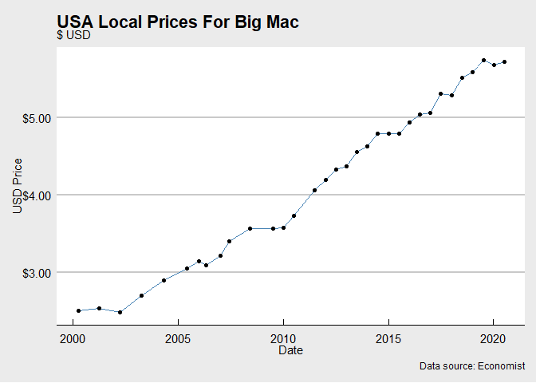

Big Mac Index \#TidyTuesday
---------------------------

Exploring the Big Mac Index from and Australian perspective. Show which
currencies the AUD is over / under values with over time.

``` r
#kable(str(bigmac))
#kable(bigmac %>% group_by(date) %>% summarize(count = n()))

# Compare the economist_theme()... 

bigmac %>% 
  filter(name == "United States") %>% 
  ggplot(aes(x=date, y=local_price)) + 
  geom_line(color="steelblue") + 
  geom_point() + theme_economist_white() +
  scale_y_continuous(labels=scales::dollar_format(.01)) + 
  labs(title = "USA Local Prices For Big Mac",
       subtitle = "$ USD",
       caption = "Data source: Economist",
       y = "USD Price",
       x = "Date")
```



``` r
bigmac %>% 
  filter(name == "Australia") %>% 
  ggplot(aes(x=date, y=local_price)) + 
  geom_line(color="steelblue") + 
  geom_point() + theme_economist() +
  scale_y_continuous(labels=scales::dollar_format(.01)) + 
  labs(title = "Australia Local Prices For Big Mac",
       subtitle = "$ AUD",
       caption = "Data source: Economist",
       y = "AUD Price",
       x = "Date")
```


``` r
# labels=scales::dollar_format(.01, prefix = "USD ")
```

Calculating Values
------------------

Using the methodology below, visualize the AUD under/over values against
given currencies

A Big Mac costs **A$6.55** in Australia and **US$5.71** in the United
States. The implied exchange rate is **1.15**. The difference between
this and the actual exchange rate, **1.43**, suggests the Australian
dollar is ***19.8% undervalued***

``` r
# Create a matrix of implied exchange rates based on local values...

implied <- bigmac  %>%
  filter(currency_code=="AUD" | 
           currency_code=="CAD" | 
           currency_code=="EUR" | 
           currency_code=="GBP" | 
           currency_code=="JPY" | 
           currency_code=="USD") %>%
  select(date, name, local_price) %>% 
  pivot_wider(names_from = name, values_from = local_price) %>%
  clean_names() %>%
  mutate(across(-date, .fns = ~ {australia / .x}, .names = "implied_{.col}"))

# Add the raw index values to the matrix

index <- bigmac %>%
    filter(name == "Australia") %>% 
    select(date, name, contains("raw")) %>% 
    pivot_wider(names_from = name, values_from = contains("raw")) %>%
    clean_names()

implied <- left_join(implied, index, by="date")

# Add actual exchange rates by reverse engineering from the implied and index values

# !! Could not figure out how to do this w/ mutate/across - need to research how to do this, maybe better use of col naming conventions and contains? Or some other form of indexing cols in the across function

implied <- implied %>% mutate(
  actual_canada = (implied_canada / (1+cny_raw_australia)), 
  actual_united_states = (implied_united_states / (1+usd_raw_australia)),
  actual_euro_area = (implied_euro_area / (1+eur_raw_australia)),
  actual_britain = (implied_britain / (1+gbp_raw_australia)),
  actual_japan = (implied_japan / (1+jpy_raw_australia))
)

# Build charts...

# Line colors
lc <- c("#006AA1", "#B7C6CF")

#Shaded area colors
sc <- c("#F15152", "#5cab7d") #green: 00A36D

implied %>% 
    select(date, implied_united_states, actual_united_states) %>% 
    pivot_longer(2:3,names_to = "Country") %>%
    ggplot(aes(x=date, y=value, size=Country, color=Country)) +
    geom_line() +
    scale_size_manual(values = c(1.1, .8)) +
    scale_color_manual(values=lc) +
    scale_y_continuous(labels=scales::dollar_format(.01)) +
    theme_economist_white()
```


``` r
main <- implied %>% 
    ggplot(aes(date)) + 
    geom_ribbon(data=implied[1:13,], aes(ymin=actual_united_states, ymax=implied_united_states), fill="#F15152", alpha=.2) +
    geom_ribbon(data=implied[13:19,], aes(ymin=actual_united_states, ymax=implied_united_states), fill="#5cab7d", alpha=.35) +
    geom_ribbon(data=implied[19:33,], aes(ymin=actual_united_states, ymax=implied_united_states), fill="#F15152", alpha=.2) +
    geom_line(aes(y=actual_united_states, color="Market"), size=1.5) +
    geom_line(aes(y=implied_united_states, color="Implied"), size=1) + 
    scale_y_continuous(labels=scales::dollar_format(.01)) +
    theme_economist_white() +
    scale_color_manual(name = "FX:", guide = "legend", values = c("Market" = "#006AA1","Implied" = "#89A2B0")) +
    guides(color = guide_legend(override.aes = list(linetype = c(1, 1)))) +
    labs(title = "Australian Dollar v U.S. Dollar",
              caption = "Source: The Economist Magazine",
              x = "Date",
              y = "USD x AUD")

EUR <- implied %>% 
    ggplot(aes(date)) + 
    geom_ribbon(data=implied[1:15,], aes(ymin=actual_euro_area, ymax=implied_euro_area), fill="#F15152", alpha=.2) +
    geom_ribbon(data=implied[15:19,], aes(ymin=actual_euro_area, ymax=implied_euro_area), fill="#5cab7d", alpha=.35) +
    geom_ribbon(data=implied[19:25,], aes(ymin=actual_euro_area, ymax=implied_euro_area), fill="#F15152", alpha=.2) +
    geom_ribbon(data=implied[25:27,], aes(ymin=actual_euro_area, ymax=implied_euro_area), fill="#5cab7d", alpha=.35)+
    geom_ribbon(data=implied[27:33,], aes(ymin=actual_euro_area, ymax=implied_euro_area), fill="#F15152", alpha=.2)+
    geom_line(aes(y=actual_euro_area, color="Market"), size=1.5) +
    geom_line(aes(y=implied_euro_area, color="Implied"), size=1) + 
    scale_y_continuous(labels=scales::dollar_format(.01)) +
    theme_economist_white() +
    scale_color_manual(name = "FX:", guide = "legend", values = c("Market" = "#006AA1","Implied" = "#89A2B0")) +
    guides(color = guide_legend(override.aes = list(linetype = c(1, 1)))) +
    labs(title = "Australian Dollar v Euro",
         caption = "Source: The Economist Magazine",
         x = "Date",
         y = "EUR x AUD")

JPY <- implied %>% 
    ggplot(aes(date)) + 
    geom_ribbon(data=implied[1:5,], aes(ymin=actual_japan, ymax=implied_japan), fill="#F15152", alpha=.2) +
    geom_ribbon(data=implied[5:33,], aes(ymin=actual_japan, ymax=implied_japan), fill="#5cab7d", alpha=.35) +
    geom_line(aes(y=actual_japan, color="Market"), size=1.5) +
    geom_line(aes(y=implied_japan, color="Implied"), size=1) + 
    scale_y_continuous(labels=scales::dollar_format(.01)) +
    theme_economist_white() +
    scale_color_manual(name = "FX:", guide = "legend", values = c("Market" = "#006AA1","Implied" = "#89A2B0")) +
    guides(color = guide_legend(override.aes = list(linetype = c(1, 1)))) +
    labs(title = "Australian Dollar v Japanese Yen",
         caption = "Source: The Economist Magazine",
         x = "Date",
         y = "JPY x AUD")
main
```


``` r
EUR
```


``` r
JPY
```


Position w/ Patchwork?

``` r
library(patchwork)

(main / (EUR | JPY))+
  plot_annotation(
  caption = "Source: The Economist Magazine"
)
```


