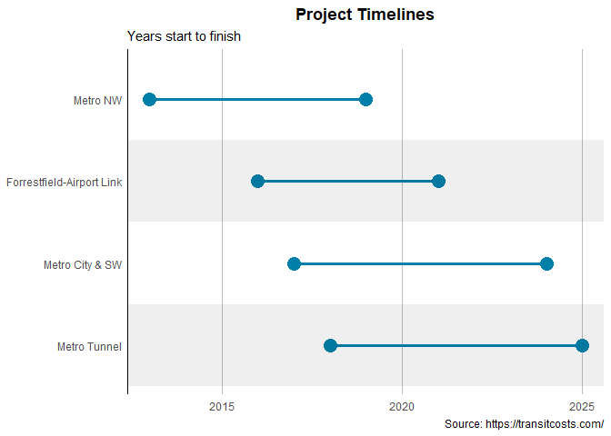
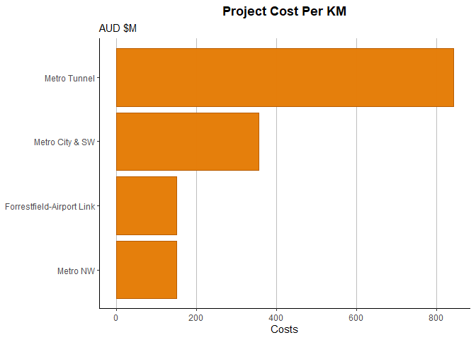
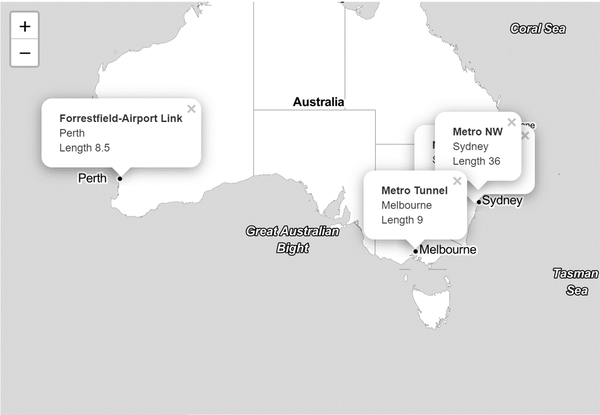
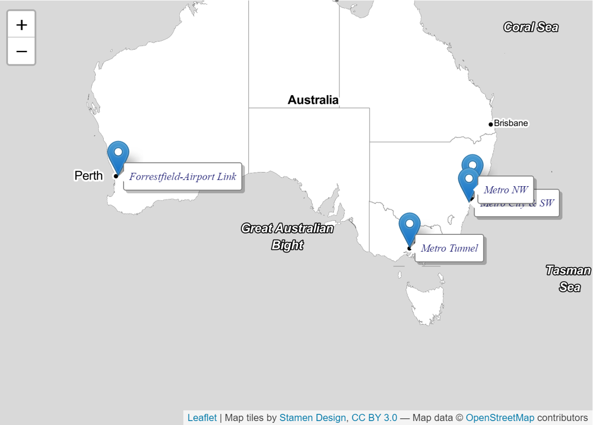
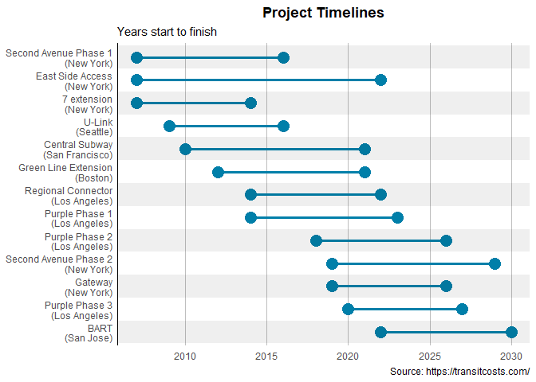
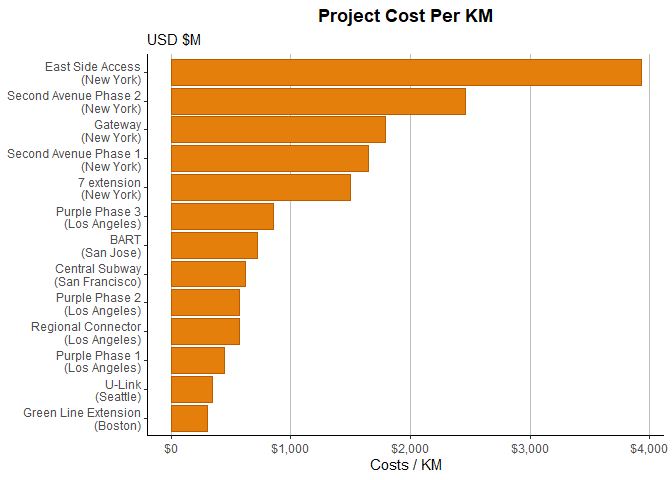
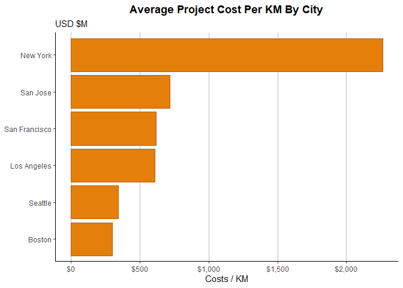
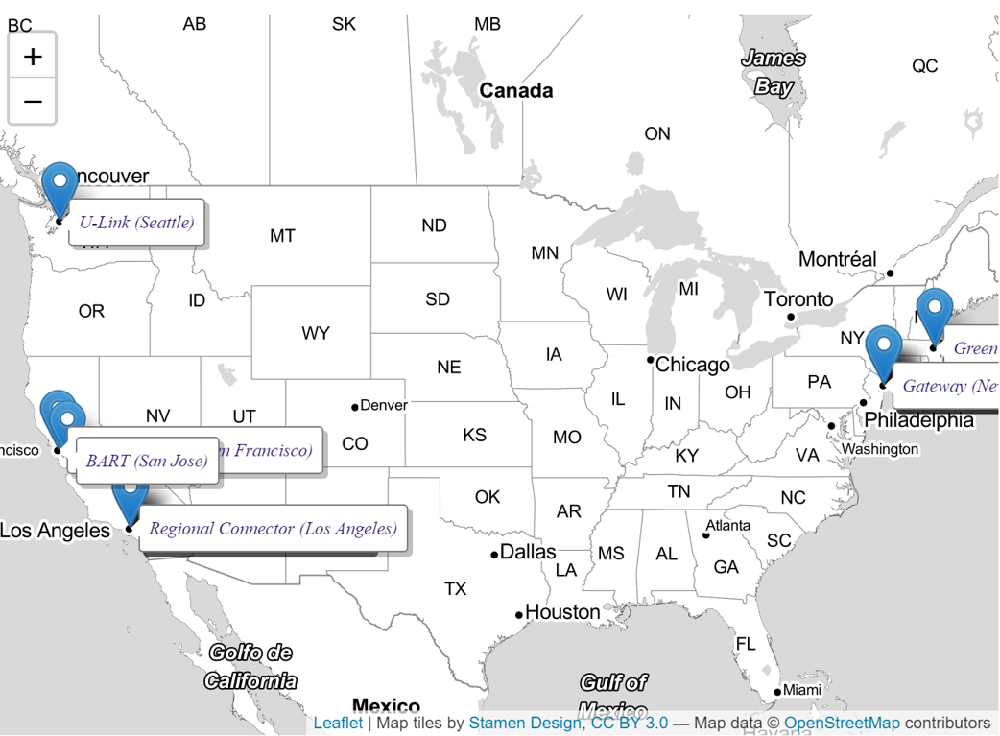

Exploratory Analysis
====================

The data is from a database that spans more than 50 countries and totals
more than 11,000 km of urban rail built since the late 1990s.

Project Timelines
-----------------

Will focus on Australia and make a nicely designed project time-line
chart that will be useful for other purposes.



Project Costs
-------------

A simple bar chart for cost per KM



Maps
----

Put the projects into a leaflet map…

``` r
#Add Lat & Long for Australia,
transit_cost[transit_cost$line == "Metro City & SW",'lat'] <- -34.18447 
transit_cost[transit_cost$line == "Metro City & SW",'long'] <- 150.78051 

transit_cost[transit_cost$line == "Metro NW",'lat'] <- -33.05082 
transit_cost[transit_cost$line == "Metro NW",'long'] <- 151.16623 

transit_cost[transit_cost$line == "Metro Tunnel",'lat'] <- -37.817187
transit_cost[transit_cost$line == "Metro Tunnel",'long'] <- 144.953335

transit_cost[transit_cost$line == "Forrestfield-Airport Link",'lat'] <- -31.976550
transit_cost[transit_cost$line == "Forrestfield-Airport Link",'long'] <- 115.990174
```

Plot projects on a map

 

USA Version
-----------

Try again, this time for the USA…




