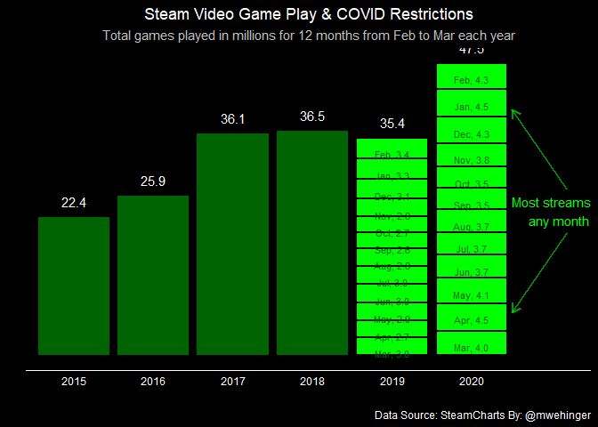
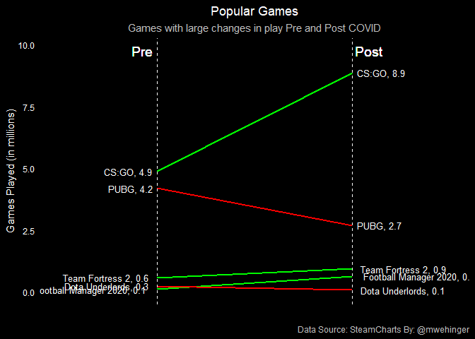

Analyzing Game Play Pre / Post COVID Restrictions
-------------------------------------------------

Inspired by www.steamcharts.com to visualize game play data…

\#TidyTuesday

``` r
# Create a bar chart to show changing volumes for 12-month periods (starting in Mar and ending in Feb)

# Create a period indicator column that will make the data easer to sort.  
games <- games %>% 
    mutate(month2 = case_when(month == "January" ~ 01, month == "February" ~ 02, month == "March" ~ 03, month == "April" ~ 04, month == "May" ~ 05, month == "June" ~ 06, month == "July" ~ 07, month == "August" ~ 08, month == "September" ~ 09, month == "October" ~ 10, month == "November" ~ 11, month == "December" ~ 12, TRUE ~0 ))

games$period <- paste(games$year, str_pad(games$month2, 2, pad = "0"), sep="")

# Adjust year to be from Mar to Feb in order to get 'lockdown years' 
games <- games %>% 
    mutate(
        lockdown = ifelse(period <= 202103 & period >= 202002, "Post", ifelse(period <= 202003 & period >= 201902, "Pre", "")), 
        adjYear = if_else(month2 == 1 | month2 ==2, year-1, year))


# The first part of the bar chart will not be stacked, but the pre/post lockdown period will be stacked by month. So make two data subsets accordingly, 

part1 <- games %>% 
    group_by(adjYear) %>% 
    summarize(streams = sum(avg)/1000000) %>% 
    mutate(streams = if_else(adjYear ==2019 | adjYear ==2020, 0, streams))

part2 <- games %>% 
    group_by(adjYear, period) %>% 
    summarize(streams = sum(avg)/1000000) %>% 
    filter(adjYear > 2018) %>% mutate(pos = cumsum(streams))

part2$lab <- paste(month.abb[as.numeric(str_sub(part2$period,-2))], format(round(part2$streams, 1)), sep=", ")

chart_1 <- part1 %>% filter(adjYear > 2014) %>% 
    ggplot(aes(x=as.character(adjYear), y=streams)) + 
    geom_bar(stat="identity",fill = "darkgreen") + 
    geom_bar(data=part2, aes(fill=period),position="stack", stat="identity",colour = "black", fill = "green", lwd=1.0) + 
    geom_text(data=part2, aes(y=pos,label = part2$lab ),vjust = 2.5,  size = 3, color="darkgreen")+
    geom_text(data=part1[part1$adjYear>2014 & part1$adjYear<2019,], aes(label = format(round(streams,1))),position = position_dodge(.9), vjust=-1, size = 4, color="white")+
    geom_text(data=part2 %>% group_by(adjYear) %>% summarize(streams = sum(streams)), aes(label = format(round(streams,1))),position = position_dodge(.9), vjust=-1, size = 4, color="white")+
    scale_x_discrete() +
    labs(
        title = "Steam Video Game Play & COVID Restrictions", 
        subtitle = "Total games played in millions for 12 months from Feb to Mar each year", 
        caption = "Data Source: SteamCharts By: @mwehinger"
    ) +
    theme_classic() + 
    theme(
        plot.title = element_text(color = "white", hjust = .5),
        plot.caption = element_text(color = "white"),
        plot.subtitle = element_text(color = "grey", hjust = .5),
        plot.background = element_rect(fill = "#000000", color = "#000000"),
        panel.background = element_rect(fill = "#000000", color = "#000000"),
        axis.text.y = element_blank(),
        axis.text.x = element_text(colour = "white"),
        axis.ticks = element_blank(),
        axis.line.y = element_blank(),
        axis.line.x = element_line(color="white")) + 
    annotate("segment", x = 7.2, xend = 6.5, y = 27, yend = 40, colour = "green", size=1, alpha=0.6, arrow=arrow(length = unit(3, "mm"))) + 
    annotate("segment", x = 7.2, xend = 6.5, y = 20, yend = 7, colour = "green", size=1, alpha=0.6, arrow=arrow(length = unit(3, "mm"))) + 
    annotate(geom = "text", x = 7.1, y = 23.5, label = "Most streams of\nany month", color = "Green") + annotate(geom = "text", x = 7.5, y = 23.5, label = " ", color = "black")

# Create a chart to show certain games changes in popularity before / after COVID

slope_data <- games %>% 
    filter(lockdown != "") %>% 
    group_by(gamename, lockdown) %>% 
    summarize(total_streams = sum(avg)/1000000) %>% 
    pivot_wider(names_from = lockdown, values_from = total_streams) %>% drop_na() %>%
    arrange(desc(Post)) %>% 
    mutate(direction = if_else(Post - Pre <0, "down", "up")) %>% 
    mutate(gamename = case_when(gamename == "Counter-Strike: Global Offensive" ~ "CS:GO", gamename == "PLAYERUNKNOWN'S BATTLEGROUNDS" ~ "PUBG", gamename == "Grand Theft Auto V" ~ "GTA V", gamename == "Tom Clancy's Rainbow Six Siege" ~ "Rainbow Six Siege", TRUE ~ gamename)) %>%
    ungroup() %>% 
    filter(gamename=="CS:GO" | gamename=="Football Manager 2020" | gamename =="Team Fortress 2" | gamename=="Dota Underlords" | gamename=="PUBG")

pre_label <- paste(slope_data$gamename, format(round(slope_data$Pre,1), nsmall=1),sep=", ")
post_label <- paste(slope_data$gamename, format(round(slope_data$Post,1), nsmall=1),sep=", ")

chart_2 <-slope_data  %>% ggplot() + geom_segment(aes(x=1, xend=2, y=Pre, yend=Post, col=direction), size=.75, show.legend=FALSE)+ 
    geom_vline(xintercept=1, linetype="dashed", size=.1, color = "white") + 
    geom_vline(xintercept=2, linetype="dashed", size=.1, color = "white") +
    scale_color_manual(labels = c("up", "down"), 
                       values = c("up"="green", "down"="red")) +
        labs(
        title = "Popular Games", 
        subtitle = "Games with large changes in play Pre and Post COVID", 
        caption = "Data Source: SteamCharts By: @mwehinger",
        y="Games Played (in millions)") +
    xlim(.5, 2.5) + 
    ylim(0,(1.1*(max(slope_data$Pre, slope_data$Post)))) + 
    geom_text(label=pre_label, y=slope_data$Pre, x=rep(1, NROW(slope_data)), hjust=1.1, size=3.5, color="white")+ 
    geom_text(label=post_label, y=slope_data$Post, x=rep(2, NROW(slope_data)), hjust=-0.1, size=3.5, color="white")+ 
    geom_text(label="Pre", x=1, y=1.1*(max(slope_data$Pre, slope_data$Post)), hjust=1.2, size=5, color="white") + 
    geom_text(label="Post", x=2, y=1.1*(max(slope_data$Pre, slope_data$Post)), hjust=-0.1, size=5, color="white")+ 
    theme(
        plot.title = element_text(color = "white", hjust = .5),
        plot.caption = element_text(color = "grey"),
        plot.subtitle = element_text(color = "grey", hjust = .5),
        plot.background = element_rect(fill = "#000000", color = "#000000"),
        panel.background = element_rect(fill = "#000000", color = "#000000"),
        panel.grid = element_blank(),
        axis.ticks = element_blank(), 
        axis.text.x = element_blank(),
        axis.text.y = element_text(color="white"),
        axis.title.y = element_text(color="white"),
        panel.border = element_blank())


chart_1
```



``` r
chart_2
```


