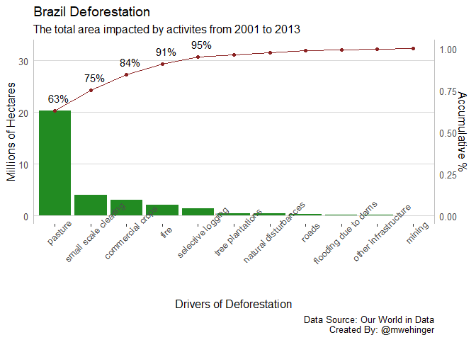
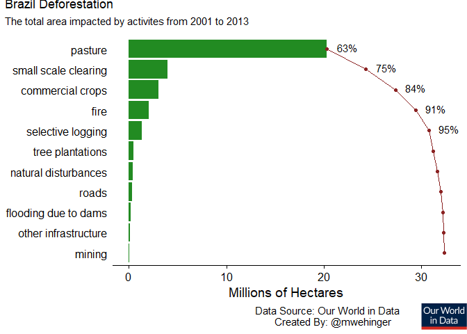

Drivers of Brazil Deforestation
-------------------------------

#### Pareto Chart

A Pareto chart visually exposes the “vital few” in the “useful many”.
Here is a pareto chart using ggplot…

``` r
# Shape the data for ggplot...
loss_causes <- brazil_loss %>% 
    pivot_longer(
        cols = commercial_crops:small_scale_clearing, 
        names_to = "cause", 
        values_to="count") %>% 
    group_by(cause) %>% 
    summarize(count = sum(count)/1000000) %>% 
    arrange(desc(count)) %>% 
    mutate(
        acc_count = cumsum(count), 
        acc_percent = (acc_count / sum(count))*100) %>%
    mutate(cause = str_replace_all(cause, "_", " ")) %>% 
    mutate(cause = str_replace(cause, "tree plantations including palm", "tree plantations")) %>%
    mutate(cause = fct_reorder(cause, acc_count, .desc = FALSE))

loss_causes %>% 
  ggplot(aes(x=cause)) + 
  geom_bar(aes(y=count), fill="forestgreen", stat = "identity") + 
  geom_point(aes(y=acc_count), color="brown4") + 
  geom_line(aes(y=acc_count, group = "cause"), color="brown4", stat = "identity") +
  scale_y_continuous(
    name="Millions of Hectares",
    sec.axis = sec_axis( trans=~./sum(loss_causes$count), name="Accumulative %")) +
  geom_text(
    aes(
      y=acc_count,
      label=ifelse(acc_percent<96, paste(as.character(round(acc_percent)), "%",sep=""),'')),hjust=.3,vjust=-1) +
  xlab("Drivers of Deforestation") +
  labs(
    title = "Brazil Deforestation",
    subtitle = "The total area impacted by activites from 2001 to 2013", 
    caption = "Data Source: Our World in Data\nCreated By: @mwehinger") + 
  theme_hc() +
  theme(axis.text.x = element_text(angle = 45),axis.ticks.y = element_blank(),axis.line.y = element_line(colour = 'grey'))
```



#### Horizontal Pareto Chart?

This is an attempt to make the pareto easier to read and more visually
appealing without losing the usefulness (aka turning it on its side).

``` r
# Shape the data for ggplot...
loss_causes <- brazil_loss %>% 
    pivot_longer(
        cols = commercial_crops:small_scale_clearing, 
        names_to = "cause", 
        values_to="count") %>% 
    group_by(cause) %>% 
    summarize(count = sum(count)/1000000) %>% 
    arrange(desc(count)) %>% 
    mutate(
        acc_count = cumsum(count), 
        acc_percent = (acc_count / sum(count))*100) %>%
    mutate(cause = str_replace_all(cause, "_", " ")) %>% 
    mutate(cause = str_replace(cause, "tree plantations including palm", "tree plantations")) %>%
    mutate(cause = fct_reorder(cause, acc_count, .desc = TRUE))

p_chart <- loss_causes %>% 
    ggplot(aes(x=cause)) + 
    geom_bar(aes(y=count), fill="forestgreen", stat = "identity") + 
    geom_point(aes(y=acc_count), color="brown4") + 
    geom_line(aes(y=acc_count, group = "cause"), color="brown4", stat = "identity") +
    geom_text(
        aes(
            y=acc_count,
            label=ifelse(acc_percent<96, paste(as.character(round(acc_percent)), "%",sep=""),'')),hjust=-.5,vjust=.3) +
    #xlab("Drivers of Deforestation") + 
    ylab("Millions of Hectares") +
    labs(
  #      title = "Brazil Deforestation",
  #      subtitle = "The total area impacted by activites from 2001 to 2013", 
        caption = "Data Source: Our World in Data\nCreated By: @mwehinger") + 
    theme_cowplot() +
    theme(
      axis.ticks.y = element_blank(),
      axis.title.y = element_blank(),
      axis.line.y = element_blank(),
      axis.text.y = element_text(hjust = 1.0),
      plot.caption = element_text(hjust = .7)) + 
  coord_flip()


title_gg <- ggplot() + 
      labs(
        title = "Brazil Deforestation",
        subtitle = "The total area impacted by activites from 2001 to 2013")

p_chart <- ggdraw() +
    draw_image("WorldInData.png",  x = 0.45, y = -0.44, scale = .1) +
    draw_plot(p_chart)

plot_grid(title_gg, p_chart, ncol = 1, rel_heights = c(0.1, 1))
```


