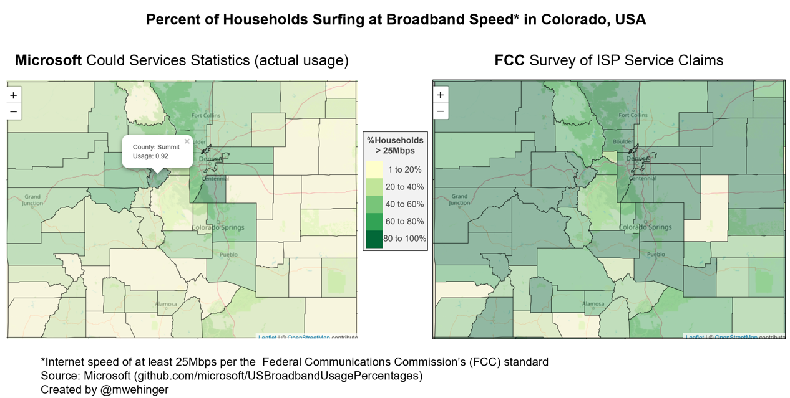

Claimed VS Actual Broadband usage in USA
----------------------------------------

This is a comparison of claimed vs actual broadband (\> 25 Mbps
internet) for Colorado. The R script uses leaflet and includes the data
for the entire USA. So, the interactive plot may be manupiluated to view
any geographic region.

-   FCC Survey of ISP Service Claims where internet speed of at least
    25Mbps is available

-   Microsoft Could Services Statistics (actual usage)

