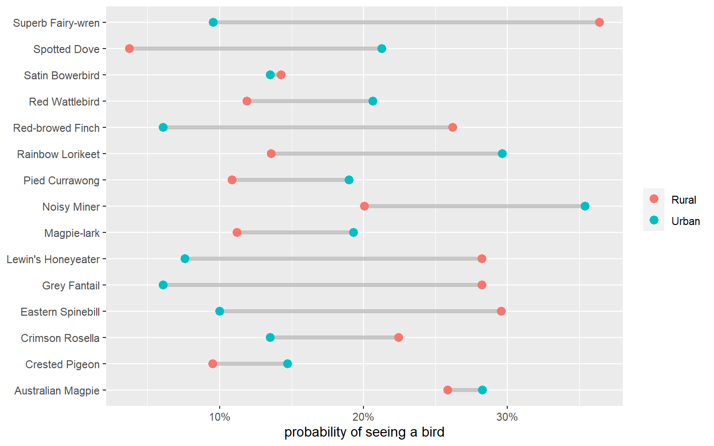
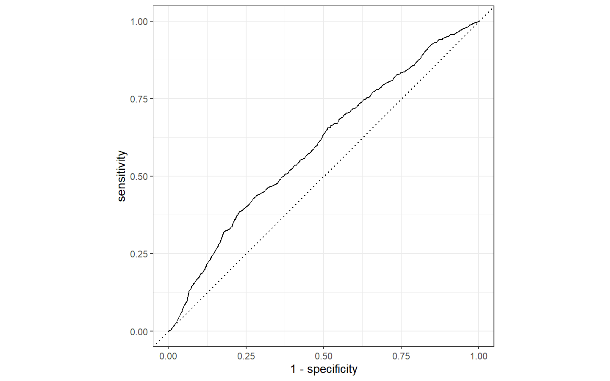
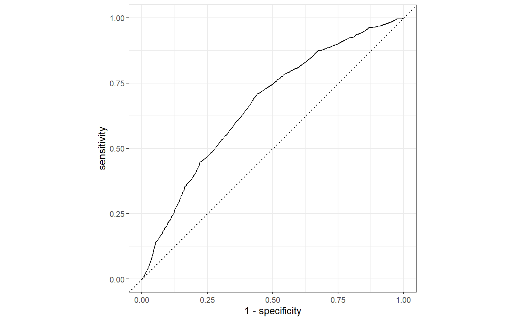
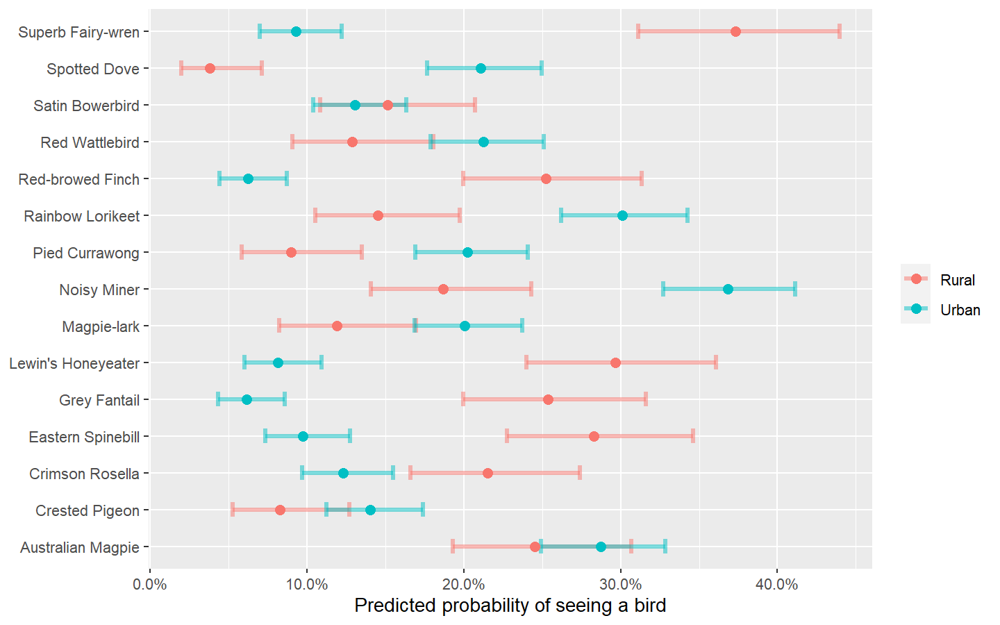
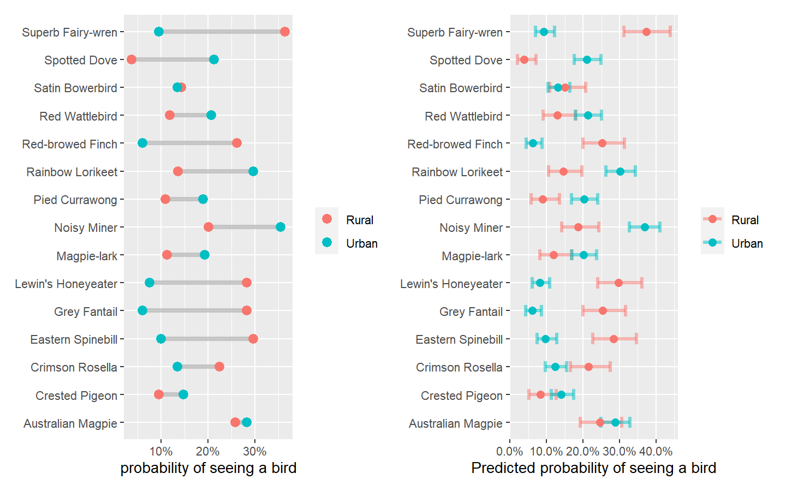

## Bird Baths

Following along with Julia Silge for Tidy Tuesday week 36. Build a model
to predict if you will see a bird at a birdbath in Australia.

### Explore Data

Data comes from Tidy Tuesday where citizen scientists from around
Australia record if they see certain types of birds.

Data indicates a 1 for when a bird is seen and 0 when there is none.
Focus on only the most often seen birds and convert 1 and 0s to a
percent. So the probability of seeing the bird.

``` r
library(tidyverse)

bird_baths <- readr::read_csv('https://raw.githubusercontent.com/rfordatascience/tidytuesday/master/data/2021/2021-08-31/bird_baths.csv')

top_birds <- bird_baths %>% 
  filter(is.na(urban_rural)) %>% 
  arrange(-bird_count) %>% 
  slice_max(bird_count, n=15) %>% 
  pull(bird_type)

bird_parsed <- bird_baths %>% 
  filter(
    !is.na(urban_rural),
    bird_type %in% top_birds) %>%
  group_by(urban_rural, bird_type) %>%
  summarize(bird_count = mean(bird_count), .groups = "drop")

p1 <- bird_parsed %>% 
  ggplot(aes(x=bird_count, y=bird_type)) + 
  geom_segment(alpha=.7, color="gray70", size=1.5,
               data = bird_parsed %>% 
                 pivot_wider(
                   names_from = urban_rural, 
                   values_from = bird_count), 
               aes(x=Rural, xend=Urban, y=bird_type, yend =bird_type)) +
  geom_point(aes(color=urban_rural), size=3) + 
  scale_x_continuous(labels = scales::percent) + 
  labs(x="probability of seeing a bird", y=NULL, color=NULL)

p1
```



### Prepare Data For Modelling

Create a data frame where the bird_count is the outcome to predict. The
urban/rural and bird_type are the factors used to make the prediction.

The data types are converted to factors

``` r
bird_df <- bird_baths %>% 
  filter(
    !is.na(urban_rural),
    bird_type %in% top_birds) %>%
  mutate(bird_count = if_else(bird_count>0, "bird", "no bird")) %>%
  mutate_if(is.character, as.factor)
```

### Build Model

Data budget - split data to training and testing. For the training set,
create re-sampling folds.

We will use a basic logistic regression. Use a recipe to set up the
feature engineering.

The formula sets the outcome and the features. Then, we pipe that to
data pre-processing steps, where we convert the predicting factors to
dummy variables (ones and zeros)

Save these elements into a workflow. The workflow holds all of the steps
into an object.

Fit model to training data re-sample folds. The fit_resamples() function
‘runs’ the fit using the work-flow

The augment() function adds two things together, in this case adding the
predicted value from training fit to the bird_coutn data-frame.

Then plot the roc curve to visualize how well (or not well) the
predictions are



Try to improve the model. We know the relationship between birds seen
and their type and rural/urban indicators are not independent.
Therefore, we will add interactions between bird type and urban/rural
data.

Use a tidymodels function to modify the original recipe,
step_interact().

Make a new work-flow with the interact recipe and fit the re-samples

and see how that impacts how the model predicts.



### Fit model on test data

Fit the workflow to the training data. With this fit model, you can do a
lot of things, like predict based on the training data

    ## # A tibble: 3,571 x 1
    ##    .pred_class
    ##    <fct>      
    ##  1 no bird    
    ##  2 no bird    
    ##  3 no bird    
    ##  4 no bird    
    ##  5 no bird    
    ##  6 no bird    
    ##  7 no bird    
    ##  8 no bird    
    ##  9 no bird    
    ## 10 no bird    
    ## # ... with 3,561 more rows

Create new bird data to predict.

You can use the augment() function again to put the model predictions
back into the new bird data.

augment() and predict() are great functions to use and know about

The chart below adds the confidence intervals along with the
predictions.

    ## # A tibble: 30 x 5
    ##    bird_type         urban_rural .pred_class .pred_bird `.pred_no bird`
    ##    <chr>             <chr>       <fct>            <dbl>           <dbl>
    ##  1 Australian Magpie Rural       no bird         0.245            0.755
    ##  2 Australian Magpie Urban       no bird         0.287            0.713
    ##  3 Crested Pigeon    Rural       no bird         0.0826           0.917
    ##  4 Crested Pigeon    Urban       no bird         0.141            0.859
    ##  5 Crimson Rosella   Rural       no bird         0.215            0.785
    ##  6 Crimson Rosella   Urban       no bird         0.123            0.877
    ##  7 Eastern Spinebill Rural       no bird         0.283            0.717
    ##  8 Eastern Spinebill Urban       no bird         0.0973           0.903
    ##  9 Grey Fantail      Rural       no bird         0.254            0.746
    ## 10 Grey Fantail      Urban       no bird         0.0614           0.939
    ## # ... with 20 more rows

    ## # A tibble: 30 x 4
    ##    .pred_lower_bird .pred_upper_bird `.pred_lower_no bird` `.pred_upper_no bird`
    ##               <dbl>            <dbl>                 <dbl>                 <dbl>
    ##  1           0.193            0.307                  0.693                 0.807
    ##  2           0.249            0.329                  0.671                 0.751
    ##  3           0.0526           0.127                  0.873                 0.947
    ##  4           0.113            0.174                  0.826                 0.887
    ##  5           0.166            0.274                  0.726                 0.834
    ##  6           0.0969           0.155                  0.845                 0.903
    ##  7           0.227            0.346                  0.654                 0.773
    ##  8           0.0736           0.127                  0.873                 0.926
    ##  9           0.200            0.316                  0.684                 0.800
    ## 10           0.0435           0.0860                 0.914                 0.957
    ## # ... with 20 more rows



Display the original data exploration chart next to the predicted chart…



The End
