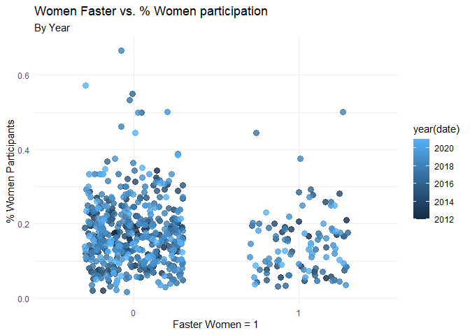

## Objective

Create charts to explore and compare ultramarathon finishing times for
women and men

The final chart:

! \[ Ultramarathon \] (Ultramarathons.png)

### Get Data

The data and its explanation are available through the TidyTuesday
GitHub repository here:
[https://github.com/rfordatascience/tidytuesday](https://github.com/rfordatascience/tidytuesday/blob/master/data/2021/2021-10-26/readme.md)

``` r
library(tidyverse)
library(lubridate) # Handling Dates
library(ggalt) #Dumbbell Chart
library(patchwork) # Patchwork to arrange multiple charts

# Load participants and their times in races...

ultra_rankings <- readr::read_csv('https://raw.githubusercontent.com/rfordatascience/tidytuesday/master/data/2021/2021-10-26/ultra_rankings.csv')

# Load race details...

race <- readr::read_csv('https://raw.githubusercontent.com/rfordatascience/tidytuesday/master/data/2021/2021-10-26/race.csv')

# Combine participant and race data...

races <- race %>% left_join(ultra_rankings, by = "race_year_id")
```

### Prepare Data

Reshape the data into a tidy list of races and the finishing times for
men and women

``` r
race_data <- races %>% 
  drop_na() %>% #Remove records where participants had no results (DNF?)
  
  # Include only 'solo' race distances of approximately 100 miles 
  filter(distance >= 161 & distance <= 171, str_to_lower(participation) =="solo") %>%
  
  # Summarize results by race and gender
  group_by(race_year_id, gender) %>% 
    summarize(
        race=first(race),
        event=first(event),
        country=first(country), 
        date=max(date), 
        elevation_gain = first(elevation_gain), 
        fastest = min(time_in_seconds), 
        average_time = mean(time_in_seconds),
        participant_count = n()) %>% 
  
  # Get data back into a wider shape where each row is a race 
  pivot_wider(
            names_from = gender, 
            values_from = c(fastest, average_time, participant_count)) %>% 
  
  # Remove those races where there are no women participants (NAs)
  drop_na() %>% 
  
  # Calculations
  mutate(
    participant_count = participant_count_M + participant_count_W,
    faster_W = if_else(average_time_W < average_time_M, 1,0),
    percent_W = participant_count_W / participant_count) %>% ungroup()
```

### Create Charts

##### Main Chart

Create a chart that highlights races where the average finish time for
women is faster than men

``` r
# Make a copy of the data for the chart...
race_data_a <- race_data %>%
  mutate_at(vars(race_year_id), factor) %>%
  
  # Set the factor order for the chart 
  mutate(race_year_id = fct_reorder(race_year_id, average_time_W)) %>%
  
  # Include only 'popular' races 
  filter(participant_count>99)

# Make a second copy with only races where women are faster than men
race_data_w <- race_data_a %>% filter(faster_W==1)


main_chart <- race_data_a %>% 
  
  ggplot(aes(y=race_year_id)) +
  
  geom_dumbbell(
        aes(x=average_time_W/60/60, xend=average_time_M/60/60),
        color="#347DC1",
        size_x=0, 
        size_xend = 2, 
        colour_x = "#CE407A", 
        colour_xend = "#347DC1") +
  
  geom_line(
        aes(x=average_time_W/60/60,group=1),
        colour = "#CE407A", size=2) +
  
  geom_segment(
    data=race_data_w, 
    aes(x= average_time_W/60/60, xend = 56, y = race_year_id, yend = race_year_id), 
    linetype = "13", 
    color = "black") +
  
  geom_text(
    data=race_data_w, 
    aes(x=56,y=race_year_id,label=paste0(race," (",year(date),")")),
    hjust = 0, 
    size=3, 
    nudge_y = 0,
    check_overlap = TRUE) +
  
  labs(
        title='Races Where Womens Average Time is Faster than Mens',
        subtitle='',
        y="",
        x="Average Finish Time (hours)") +
  
  theme_classic() +
  
  theme(
        plot.title = element_text(size = 12, hjust = .5),
        axis.title.y = element_text(size = 11),
        axis.text.y=element_blank(), 
        axis.ticks.y = element_blank(), 
        axis.line.y = element_blank(),
        plot.background = element_rect(fill = "#E8E6E6", color = NA),
        panel.background = element_rect(fill = "#E8E6E6", color = NA))
```

##### Sub-Charts

Create ‘sub-charts’ showing individual races of note

``` r
wser <- race %>%
  left_join(ultra_rankings, by = "race_year_id") %>% 
  filter(race=="Western States Endurance Run", year(date)>2016) %>% 
    
  ggplot(aes(as.factor(gender),time_in_seconds/60/60)) +
  geom_jitter(aes(color=as.factor(gender)),width=.1) +
  
  scale_color_manual(values=c("#347DC1","#CE407A")) +
  scale_x_discrete(position = "top") +
  scale_y_continuous(limits=c(15,60), position = "right") +
  
  labs(
        title='',
        subtitle='Western States Endurance Run',
        y="Finish Time (hours)",
        x="") +
  
  theme_classic() +
  
  theme(
      plot.subtitle = element_text(size = 10),
      axis.title.y = element_blank(),
      axis.line.y = element_blank(),
      plot.background = element_rect(fill = "#E8E6E6", color = NA),
      panel.background = element_rect(fill = "#E8E6E6", color = NA),
      legend.position = "none")

and <- race %>% 
  left_join(ultra_rankings, by = "race_year_id") %>% 
  filter(race=="ANDORRA RONDA DELS CIMS") %>%
  
  ggplot(aes(as.factor(gender),time_in_seconds/60/60)) +
  geom_jitter(aes(color=as.factor(gender)),width=.1) +
  
  scale_color_manual(values=c("#347DC1","#CE407A")) +
  scale_x_discrete(position = "top") +
  scale_y_continuous(limits=c(15,60), position = "right") +
  
  labs(
        title='',
        subtitle='ANDORRA RONDA DELS CIMS',
        y="Finish Time (hours)",
        x="") +
  
  theme_classic() +
  
  theme(
      plot.subtitle = element_text(size = 10),
      axis.title.y = element_blank(),
      axis.line.y = element_blank(),
      plot.background = element_rect(fill = "#E8E6E6", color = NA),
      panel.background = element_rect(fill = "#E8E6E6", color = NA),
      legend.position = "none")

utmb <- race %>% 
  left_join(ultra_rankings, by = "race_year_id") %>% drop_na() %>% 
  filter(race=="UTMB®") %>% 
  
  ggplot(aes(as.factor(gender),time_in_seconds/60/60)) + 
  geom_jitter(aes(color=as.factor(gender)),width=.2) +
  
  scale_color_manual(values=c("#347DC1","#CE407A")) +
  scale_x_discrete(position = "top") +
  scale_y_continuous(limits=c(15,60), position = "right") +
  labs(
        title='',
        subtitle='UTMB®',
        y="Finish Time (hours)",
        x="") +
  
  theme_classic() +
  
  theme(
      plot.subtitle = element_text(size = 10),
      axis.title.y = element_text(size = 10),
      axis.line.y = element_blank(),
      plot.background = element_rect(fill = "#E8E6E6", color = NA),
      panel.background = element_rect(fill = "#E8E6E6", color = NA),
      legend.position = "none")
```

### Combine Charts

Use Patchwork to combine and annotate charts

``` r
final <- main_chart | (and / utmb / wser)

final + 
  plot_layout(widths = c(3, 1)) + 
  plot_annotation(
    caption = "Created By: @mwehinger, Data Source: @BjnNowak, https://itra.run/Races/FindRaceResults",
    title = "Ultramarathon Finishing Times Women v Men",
    subtitle = "Distance 160 KMs (100 miles)", 
    
    theme=theme(
        plot.title = element_text(
          size = 22, 
          color = "#40711D", 
          hjust = 0.5, 
          margin = margin(5,0,2,0)),
        
        plot.subtitle = element_text(
          size = 14, 
          color = "black", 
          hjust = 0.5, 
          margin = margin(0,0,10,0),
          lineheight = 1.2),
        
        plot.caption = element_text(
          size = 11, 
          color = "black", 
          hjust = 0.95, 
          margin = margin(5,0,5,0)), 
        
        plot.background = element_rect(fill = "#E8E6E6", color = NA)))
```


## The End

Other exploratory charts…

``` r
races <- race %>% left_join(ultra_rankings, by = "race_year_id") %>% drop_na()

races %>%
  mutate(
        year=year(date),
        time=period_to_seconds(hms(time))) %>% 
    filter(race == "UTMB®") %>% 
    filter(year==2013 | year==2021) %>% 
    group_by(year, gender) %>% 
    summarize(meanTime = mean(time)) %>%
    ungroup() %>%
    ggplot(aes(x=meanTime/60/60, y=as.factor(year), color=gender)) + 
    geom_point(size=5)+
    labs(
        title='Mean time for UTMB finishers',
        subtitle='Comparison by genders for years 2013 and 2021',
        y="",
        x="Mean finishing time (hours)"
    )+
    theme_minimal()
```


``` r
# Explore the data...

race_data %>% 
  ggplot(aes(x=as.factor(faster_W), y=percent_W, color=year(date))) +
  geom_jitter(size=3, alpha=.8, width = .3)+
    labs(
      title='Women Faster vs. % Women participation',
      subtitle='By Year',
      y="% Women Participants",
      x="Faster Women = 1"
    )+
  theme_minimal()
```



``` r
race_data %>% 
  ungroup() %>% 
  mutate(race = fct_reorder(race, average_time_W)) %>% 
  ggplot(aes(y=race)) + 
  geom_dumbbell(
    aes(x=average_time_W/60/60, xend=average_time_M/60/60),
    color="grey60",
    size_x=3, 
    size_xend = 3, 
    colour_x = "deeppink2", 
    colour_xend = "royalblue1")+
  labs(
      title='Average Finish Times',
      subtitle='Woman v Man',
      y="Avg. Finish Time (hours)",
      x=""
    ) +
  theme_minimal()
```


``` r
race_data %>% 
  ungroup() %>% filter(year(date)==2021) %>% 
  mutate(race = fct_reorder(race, average_time_W)) %>% 
  ggplot(aes(y=race)) + 
  geom_dumbbell(
    aes(x=average_time_W/60/60, xend=average_time_M/60/60),
    color="grey60",
    size_x=3, 
    size_xend = 3, 
    colour_x = "deeppink2", 
    colour_xend = "royalblue1")+
  labs(
      title='2021 Average Finish Times',
      subtitle='Woman v Man',
      y="Avg. Finish Time (hours)",
      x=""
    ) +
  theme_minimal()
```


``` r
race_data %>% 
  ungroup() %>% 
  ggplot(aes(x=average_time_W, y=elevation_gain)) + 
  geom_point(colour = "deeppink2", size=3, alpha=.7) + 
  geom_point(aes(x=average_time_M), color="royalblue1", size=3, alpha=.7)+
  labs(
      title='Average Time vs. Elevation Gain',
      subtitle='Woman v Man',
      y="Elevation Gain",
      x="Avg. Finish Time (hours)"
    ) +
  theme_minimal()
```


