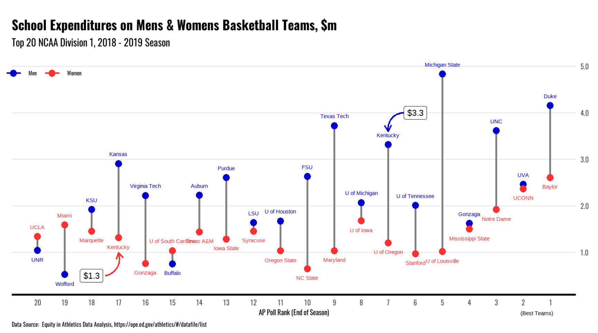
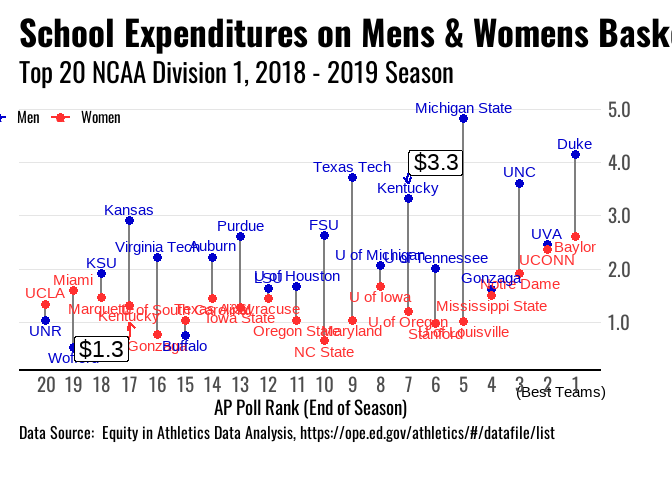

## NCAA Baketball Team Revenue & Expenses Men vs Women

Looking at the 2019 - 2020 season (because the latest data available was
disrupted by COVID).



``` r
library(tidyverse)
library(grid)
library(scales)
library(showtext)

font_add_google("Oswald")
showtext_auto()


# Get Data
# sports <- readr::read_csv('https://raw.githubusercontent.com/rfordatascience/tidytuesday/master/data/2022/2022-03-2# 9/sports.csv')

# Load only data for basketball...
sports <- readxl::read_excel("EADA_2019.xlsx")

# Select cols of interest...
sports <- sports %>% 
  select(
    institution_name,
    classification_name,
    city_txt, state_cd,
    
    participants_women = PARTIC_WOMEN_Bskball,
    OPEX_per_women_participants = OPEXPPERPART_WOMEN_Bskball,
    OPEX_per_women_team = OPEXPPERTEAM_WOMEN_Bskball,
    revenue_women = REV_WOMEN_Bskball,

    participants_men = PARTIC_MEN_Bskball,
    OPEX_per_men_participants = OPEXPPERPART_MEN_Bskball,
    OPEX_per_men_team = OPEXPPERTEAM_MEN_Bskball,
    revenue_men =   REV_MEN_Bskball,

  )

# Add end of year AP rankings for the Top 20,

sports <- sports %>% mutate(
    mens_rank = case_when(
      institution_name == "Duke University" ~ 1,
      institution_name == "University of Virginia-Main Campus" ~ 2,
      institution_name == "University of North Carolina at Chapel Hill" ~ 3,
      institution_name == "Gonzaga University" ~ 4,
      institution_name == "Michigan State University" ~ 5,
      institution_name == "The University of Tennessee-Knoxville" ~ 6,
      institution_name == "University of Kentucky" ~ 7,
      institution_name == "University of Michigan-Ann Arbor" ~ 8,
      institution_name == "Texas Tech University" ~ 9,
      institution_name == "Florida State University" ~ 10,
      institution_name == "University of Houston" ~ 11,
      institution_name == "Louisiana State University and Agricultural & Mechanical College" ~ 12,
      institution_name == "Purdue University-Main Campus" ~ 13,
      institution_name == "Auburn University" ~ 14,
      institution_name == "University at Buffalo" ~ 15,
      institution_name == "Virginia Polytechnic Institute and State University" ~ 16,
      institution_name == "University of Kansas" ~ 17,
      institution_name == "Kansas State University" ~ 18,
      institution_name == "Wofford College" ~ 19,
      institution_name == "University of Nevada-Reno" ~ 20,
      TRUE ~ 0
    ),
    
    womens_rank = case_when(
      institution_name=="Baylor University" ~ 1,
      institution_name=="University of Connecticut" ~ 2,
      institution_name=="University of Notre Dame" ~ 3,
      institution_name=="Mississippi State University" ~ 4,
      institution_name=="University of Louisville" ~ 5,
      institution_name=="Stanford University" ~ 6,
      institution_name=="University of Oregon" ~ 7,
      institution_name=="University of Iowa" ~ 8,
      institution_name=="University of Maryland-College Park" ~ 9,
      institution_name=="North Carolina State University at Raleigh" ~ 10,
      institution_name=="Oregon State University" ~ 11,
      institution_name=="Syracuse University" ~ 12,
      institution_name=="Iowa State University" ~ 13,
      institution_name=="Texas A & M University-College Station" ~ 14,
      institution_name=="University of South Carolina-Columbia" ~ 15,
      institution_name=="Gonzaga University" ~ 16,
      institution_name=="University of Kentucky" ~ 17,
      institution_name=="Marquette University" ~ 18,
      institution_name=="University of Miami" ~ 19,
      institution_name=="University of California-Los Angeles" ~ 20,
      TRUE ~ 0
    ),
    # Shorten the names so the appear better on the chart
    institution_name = case_when(
      institution_name == "Duke University" ~ "Duke",
      institution_name == "University of Virginia-Main Campus" ~ "UVA",
      institution_name == "University of North Carolina at Chapel Hill" ~ "UNC",
      institution_name == "Gonzaga University" ~ "Gonzaga",
      institution_name == "Michigan State University" ~ "Michigan State",
      institution_name == "The University of Tennessee-Knoxville" ~ "U of Tennessee",
      institution_name == "University of Kentucky" ~ "Kentucky",
      institution_name == "University of Michigan-Ann Arbor" ~ "U of Michigan",
      institution_name == "Texas Tech University" ~ "Texas Tech",
      institution_name == "Florida State University" ~ "FSU",
      institution_name == "University of Houston" ~ "U of Houston",
      institution_name == "Louisiana State University and Agricultural & Mechanical College" ~ "LSU",
      institution_name == "Purdue University-Main Campus" ~ "Purdue",
      institution_name == "Auburn University" ~ "Auburn",
      institution_name == "University at Buffalo" ~ "Buffalo",
      institution_name == "Virginia Polytechnic Institute and State University" ~ "Virginia Tech",
      institution_name == "University of Kansas" ~ "Kansas",
      institution_name == "Kansas State University" ~ "KSU",
      institution_name == "Wofford College" ~ "Wofford",
      institution_name == "University of Nevada-Reno" ~ "UNR",
      institution_name=="Baylor University" ~ "Baylor",
      institution_name=="University of Connecticut" ~ "UCONN",
      institution_name=="University of Notre Dame" ~ "Notre Dame",
      institution_name=="Mississippi State University" ~ "Mississippi State",
      institution_name=="University of Louisville" ~ "U of Louisville",
      institution_name=="Stanford University" ~ "Stanford",
      institution_name=="University of Oregon" ~ "U of Oregon",
      institution_name=="University of Iowa" ~ "U of Iowa",
      institution_name=="University of Maryland-College Park" ~ "Maryland",
      institution_name=="North Carolina State University at Raleigh" ~ "NC State",
      institution_name=="Oregon State University" ~ "Oregon State",
      institution_name=="Syracuse University" ~ "Syracuse",
      institution_name=="Iowa State University" ~ "Iowa State",
      institution_name=="Texas A & M University-College Station" ~ "Texas A&M",
      institution_name=="University of South Carolina-Columbia" ~ "U of South Carolina",
      institution_name=="Marquette University" ~ "Marquette",
      institution_name=="University of Miami" ~ "Miami",
      institution_name=="University of California-Los Angeles" ~ "UCLA",
      
      TRUE ~ institution_name
    ),
  ) %>% 
  
  filter(mens_rank !=0 | womens_rank !=0)

# Separate Men's Data
men <- sports %>% filter(mens_rank>0) %>% select(name_men = institution_name, OPEX_per_men_participants, OPEX_per_men_team, revenue_men, rank = mens_rank)

# Separate Women's Data
women <- sports %>% filter(womens_rank>0) %>% select(name_women = institution_name, OPEX_per_women_participants, OPEX_per_women_team, revenue_women, rank = womens_rank)

# Combine Men and Women Data into one table
sports <- men %>% left_join(women)

# Create a Best Teams label 
best_teams <- textGrob("(Best Teams)", gp=gpar(fontsize=11))

# Make Chart
sports %>% 
  #Plot AP Rank on x-axis (reversed)  
  ggplot(aes(x=rank)) + 
    geom_segment(aes(
        x=rank, xend=rank, 
        y=OPEX_per_men_team/1000000, yend=OPEX_per_women_team/1000000), 
        size=1, 
        color="grey50") + 
    
    geom_point(aes(y=OPEX_per_men_team/1000000, color="Men"), size=3) + 
    geom_point(aes(y=OPEX_per_women_team/1000000, color="Women"), size=3) +
    
    labs(x = "AP Poll Rank (End of Season)", y="",
         title = "School Expenditures on Mens & Womens Basketball Teams, $m",
         subtitle = "Top 20 NCAA Division 1, 2018 - 2019 Season",
         caption = "Data Source:  Equity in Athletics Data Analysis, https://ope.ed.gov/athletics/#/datafile/list") + 
    theme_minimal() + 
    
    # Add University Names
    geom_text(aes(
        x=rank, 
        y=ifelse(OPEX_per_women_team < OPEX_per_men_team, OPEX_per_women_team/1000000-.2, OPEX_per_women_team/1000000+.2),
        label=name_women, color="Women")) +
    
    geom_text(aes(
        x=rank, 
        y=ifelse(OPEX_per_men_team > OPEX_per_women_team, OPEX_per_men_team/1000000+.2, OPEX_per_men_team/1000000-.2),
        label=name_men, color="Men")) +
    
    #Highlight Kentucky
    geom_curve(
        aes(x = 17.5, y = .5, xend = 17, yend = 1, color="Women"), size=.8,
        arrow = arrow(length = unit(0.03, "npc"))) +
  
    geom_label(aes(x=18, y=.5, label="$1.3"),color="black", size=6) +
  
    geom_curve(
        aes(x = 6.4, y = 4, xend = 7, yend = 3.6, color="Men"), size=.8,
        arrow = arrow(length = unit(0.03, "npc"))) +
  
    geom_label(aes(x=6, y=4, label="$3.3"),color="black", size=6) +
  
    #Assign Colors to Men and Women data points
    scale_color_manual(name = NULL,
                       guide = "legend",
                       values = c("Men" = "mediumblue",
                                  "Women" = "firebrick1")) +
    theme(
        text = element_text(family = "Oswald",size=14), 
        axis.line.x = element_line(size=1, color="black"),
        axis.text = element_text(size=14),
        plot.title = element_text(face="bold", size=26, hjust=0),
        plot.subtitle = element_text(size=20, hjust=0),
        plot.caption = element_text(size=12, hjust=0,), 
        plot.margin = unit(c(1,1,2,1), "lines"),
        panel.grid.major.y =  element_line(color = "gray90", size = .5),
        panel.grid.minor.y =  element_blank(),
        panel.grid.major.x =  element_blank(),
        panel.grid.minor.x =  element_line(color = "gray90", size = .5),
        legend.position = c(.05,.92)) + guides(color = guide_legend(direction = "horizontal"))+ 
    
    scale_y_continuous(position = "right",labels = label_number(accuracy = 0.1)) + 
    
    scale_x_reverse(breaks = seq(20, 1, -1),
                    minor_breaks = seq(20, 1, -5)) + 
  
    # Add the 'best teams' annotation below the x-axis
    annotation_custom(best_teams, xmin=-1, xmax=-2, ymin=-.3, ymax=-.3) + 
    coord_cartesian(clip = "off")
```


