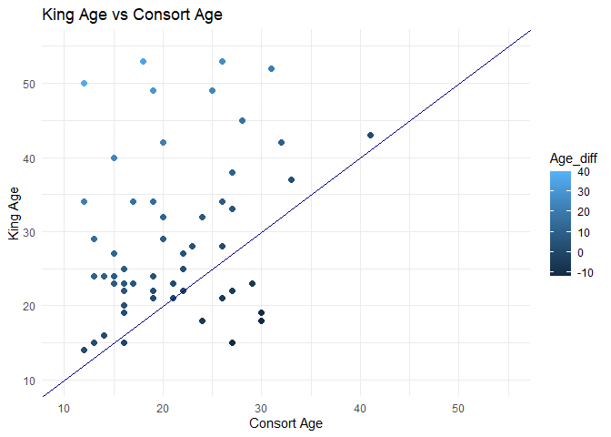
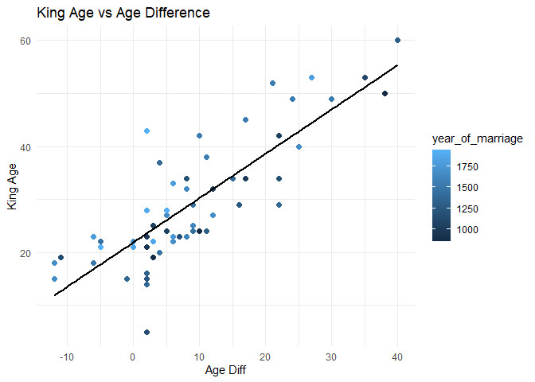
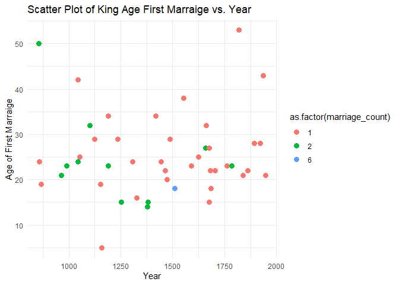
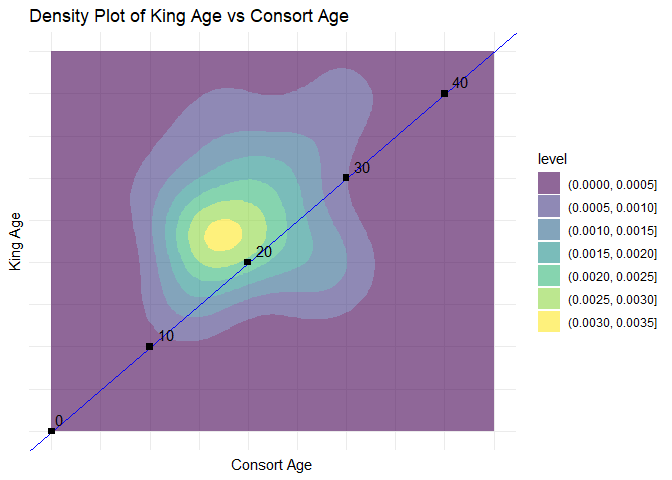
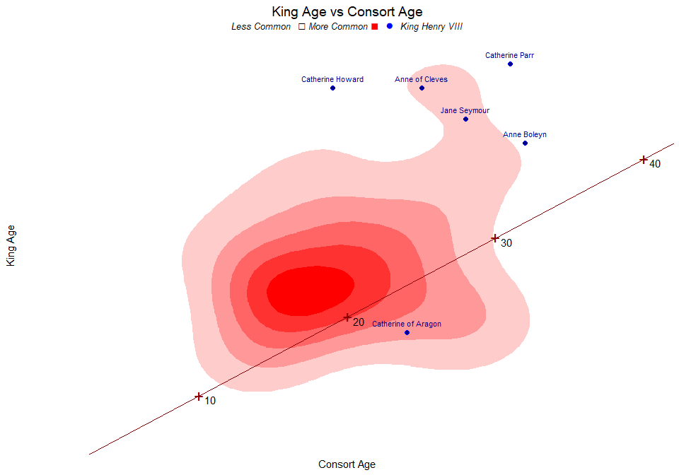

<style>
.plot-shadow {
    box-shadow: 5px 5px 10px rgba(0, 0, 0, 0.3);
    border-radius: 5px;
}
</style>

TidyTuesday 2024 Week 34

### Retrieve and Clean Data

``` r
english_monarchs <- readr::read_csv('https://raw.githubusercontent.com/rfordatascience/tidytuesday/master/data/2024/2024-08-20/english_monarchs_marriages_df.csv')
```

    ## Rows: 83 Columns: 5
    ## ── Column specification ────────────────────────────────────────────────────────
    ## Delimiter: ","
    ## chr (5): king_name, king_age, consort_name, consort_age, year_of_marriage
    ## 
    ## ℹ Use `spec()` to retrieve the full column specification for this data.
    ## ℹ Specify the column types or set `show_col_types = FALSE` to quiet this message.

``` r
# Data cleaning...
english_monarchs <- english_monarchs %>%
  # Remove "(?)"
  mutate(
    across(everything(), ~ str_replace_all(., "\\(\\?\\)", "")),  
  # Replace dash and questionmarks with NA
    across(everything(), ~ na_if(., "–")),
    across(everything(), ~ na_if(., "?")),
    king_age = as.numeric(king_age), 
    consort_age = as.numeric(consort_age),
    year_of_marriage = as.numeric(year_of_marriage),
    Age_diff = king_age - consort_age
  ) %>% 
  # Count how many times a king is married
  add_count(king_name, name = "marriage_count")
```

### Explore Data & Visualizations

``` r
#Chart: King vs Consort Age
english_monarchs %>% 
  drop_na() %>% 
  ggplot(aes(x = consort_age, y = king_age, color = Age_diff)) + 
  geom_point(size=2) + 
  geom_abline(slope = 1, intercept = 0, linetype = "solid", color = "darkblue") +
  labs(
    title = "King Age vs Consort Age",
    x = "Consort Age",
    y = "King Age"
  ) +
  xlim(10, 55) +  # Set the x-axis range from 0 to 45
  ylim(10, 55) +
  theme_minimal()
```



``` r
#Chart: King Age vs Age Difference
english_monarchs %>% 
    drop_na() %>% 
    ggplot(aes(x = Age_diff, y = king_age, color = year_of_marriage)) + 
    geom_point(size=2) + 
    geom_smooth(method = "lm", se = FALSE, color = "black") +
    labs(
        title = "King Age vs Age Difference",
        x = "Age Diff",
        y = "King Age"
    ) +
    theme_minimal()
```

    ## `geom_smooth()` using formula 'y ~ x'



``` r
#Chart: Age of the king on first marriage and year
english_monarchs %>% 
    drop_na() %>%
    group_by(king_name) %>% 
    summarize(
      king_age = min(king_age), 
      year_of_marriage = min(year_of_marriage), 
      marriage_count = max(marriage_count)) %>%
    ggplot(aes(x = year_of_marriage, y = king_age, color = as.factor(marriage_count))) + 
    geom_point(size=3) + 
        labs(
        title = "Scatter Plot of King Age First Marraige vs. Year",
        x = "Year",
        y = "Age of First Marraige"
    ) +
    theme_minimal()
```



``` r
#Chart: A Density Plot? 
english_monarchs %>% 
    drop_na() %>% 
    ggplot(aes(x = consort_age, y = king_age)) + 
    geom_density_2d_filled(alpha = 0.6) +  
    geom_abline(slope = 1, intercept = 0, linetype = "solid", color = "blue") +
    labs(
        title = "Density Plot of King Age vs Consort Age",
        x = "Consort Age",
        y = "King Age"
    ) + 
    xlim(0, 45) +  
    ylim(0, 45) +
     theme_minimal() + theme(
        axis.line = element_blank(),  # Remove axis lines
        axis.ticks = element_blank(),  # Remove axis ticks
        axis.text = element_blank()    # Remove axis text
    ) +
    annotate("text", x = seq(0, 45, by = 10), y = seq(0, 45, by = 10), 
             label = seq(0, 45, by = 10), color = "black", hjust = -0.5, vjust = -0.5) + 
    
    geom_point(data = data.frame(x = seq(0, 45, by = 10), y = seq(0, 45, by = 10)),
               aes(x = x, y = y), shape = 15, size = 2, color = "black")
```



### Final Plot

``` r
# Final Plot

title <- "King Age vs Consort Age<br><i><span style='font-size:10pt;'>Less Common</span></i> <b>&#x25A1;</b><i><span style='font-size:10pt;'>   More Common </span></i><span style='color:red'><b>&#x25A0;</b></span>   <span style='color:blue'><b>&#x25CF;</b></span> <i><span style='font-size:10pt;'>King Henry VIII</span></i>"

english_monarchs %>% drop_na() %>%
    ggplot(aes(x = consort_age, y = king_age)) + 
    geom_density_2d_filled(alpha = 1) + 
    scale_fill_manual(values = colorRampPalette(c("white", "red"))(6)) +
    geom_abline(slope = 1, intercept = 0, linetype = "solid", color = "darkred") +
    geom_point(data = english_monarchs %>% filter(king_name=="Henry VIII"), aes(x = consort_age, y = king_age),shape = 21, size = 2, color = "blue", fill = "darkblue") +
    geom_text(data = english_monarchs %>% filter(king_name=="Henry VIII"), 
              aes(x = consort_age, y = king_age, label = consort_name ), vjust = -1, hjust = 0.5, color = "darkblue", size = 3) +
    labs(
        title = title,
        x = "Consort Age",
        y = "King Age"
    ) + 
    
    xlim(0, 40) +  # Set the x-axis range from 0 to 45
    ylim(5, 53) +
    
    annotate("text", x = seq(0, 45, by = 10), y = seq(0, 45, by = 10), 
             label = seq(0, 45, by = 10), color = "black", hjust = -0.5, vjust = 1) +
    
    geom_point(data = data.frame(x = seq(0, 45, by = 10), y = seq(0, 45, by = 10)), aes(x = x, y = y), shape = 43, stroke =2, size = 5, color = "darkred") +
    
    theme_minimal() + 
    theme(
        axis.line = element_blank(),  # Remove axis lines
        axis.ticks = element_blank(),  # Remove axis ticks
        axis.text = element_blank(),  # Remove axis text
        legend.position = "none",
        plot.title = element_markdown(hjust = 0.5, size = 14),
        panel.grid = element_blank()
    )
```


