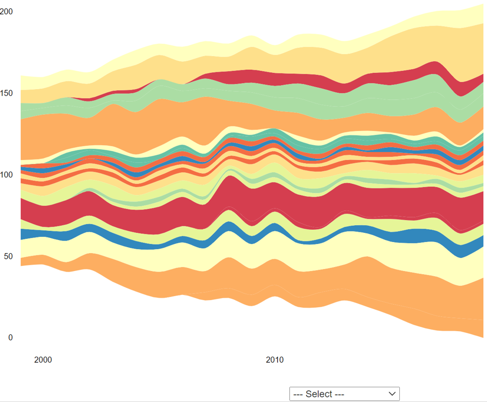
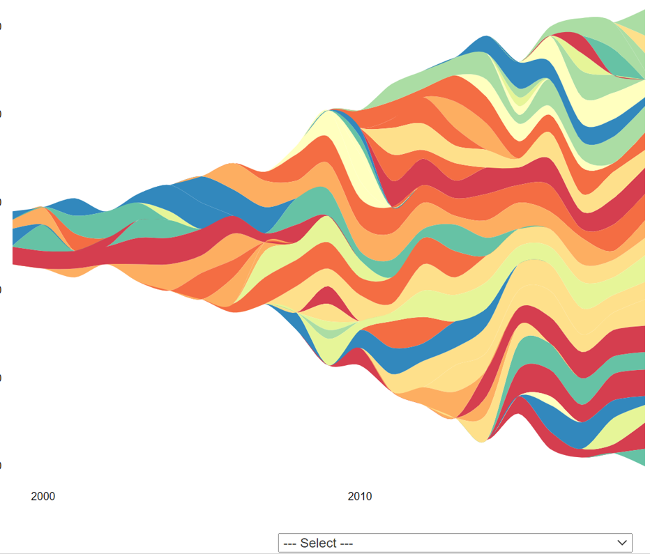
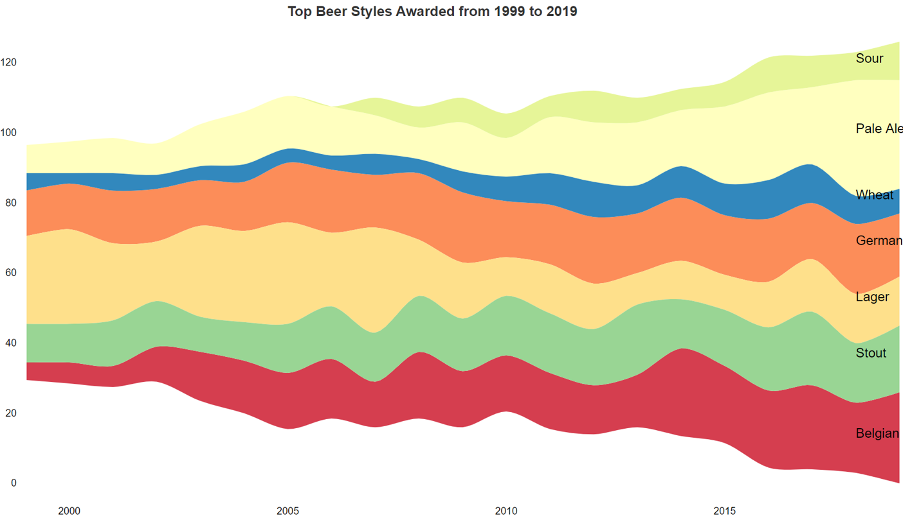

```{r setup, include=FALSE}
knitr::opts_chunk$set(echo = TRUE)
library(tidyverse)
library(knitr)
library(kableExtra)
library(streamgraph)
library(ggstream)
library(cowplot)

# Get the data
  
# beer_me <- readr::read_csv('https://raw.githubusercontent.com/rfordatascience/tidytuesday/master/data/2020/2020-10-20/beer_awards.csv')
# write.csv(beer_me, "GABF.csv", row.names = FALSE)

beer_me <- readr::read_csv("GABF.csv")

```

## Explore Data

Number of beers awarded medals per year. There is a steady year-on-year rise until 2020 - is this because of COVID? May bookend analysis for twenty years from 1999 to 2019

```{r YearVol, echo=FALSE, message=FALSE}
plot_grid(
beer_me %>% group_by(year, medal) %>% summarize(n = n()) %>% ggplot(aes(x = year, y = n))+
    geom_col(aes(fill = medal), width = 0.7),

beer_me %>% group_by(year) %>% summarize(n = n()) %>% ggplot(aes(x = year, y = n)) + geom_line()
)
```


There were 515 different categories used in the dataset (from 1987 to 2020), but only 90 used in 2020 meaning, 

* Some categories were dropped or added
* Some categories could be renamed

```{r Categories, echo=FALSE, message=FALSE}
table1 <- head(beer_me %>% group_by(category) %>% summarize(n = n()) %>% arrange(desc(n)),20)

table2 <- head(beer_me[beer_me$year == 2020,] %>% group_by(category) %>% summarize(n = n()) %>% arrange(desc(n)),20)

kable(table1, caption = "Top 20 most used categories") %>%
  kable_styling(full_width = FALSE, position = "float_left")
kable(table2, caption = "Top 20 2020") %>%
  kable_styling(full_width = FALSE, position = "left")

```

Will simplify the classifications to show broader beer types and reduce the numver of different categories down to 23 (excluding 'Other') 

```{r simpleCat, echo=FALSE, message=FALSE}
beer_me <- beer_me %>% mutate(SimpleCat = case_when(
  str_detect(category, "Stout") ~ "Stout",
  str_detect(category, "Bock") ~ "Bock",
  str_detect(category, "Porter") ~ "Porter",
  str_detect(category, "Pale Ale") ~ "Pale Ale",
  str_detect(category, "Belgian|Belgo") ~ "Belgian Beer",
  str_detect(category, "Brown Ale") ~ "Brown Ale",
  str_detect(category, "Red Ale") ~ "Red Ale",
  str_detect(category, "Wheat|Witbier") ~ "Wheat Beer",
  str_detect(category, "Sour") ~ "Sour",
  str_detect(category, "Pilsener") ~ "Pilsener",
  str_detect(category, "Lager") ~ "Lager",
  str_detect(category, "India Pale Ale") ~ "India Pale Ale",
  str_detect(category, "Barley Wine") ~ "Barley Wine",
  str_detect(category, "Rye Beer") ~ "Rye Beer",
  str_detect(category, "Specialty Beer") ~ "Specialty Beer",
  str_detect(category, "Scottish") ~ "Scottish-Style Ale",
  str_detect(category, "Experimental") ~ "Experimental Beer",
  str_detect(category, "Summer Ale") ~ "Summer Ale",
  str_detect(category, "Aged") ~ "Aged",
  str_detect(category, "Session") ~ "Session",
  str_detect(category, "Fruit|Spice|Raspberry") ~ "Fruit Beer",
  str_detect(category, "Blonde|Gold") ~ "Golden or Blonde Ale",
  str_detect(category, "Bitter") ~ "Bitter",
  str_detect(category, "German|Bier|Munich|Munchner|Oktoberfest|Hefeweizen|Hefeweissbier") ~ "German Style",
  str_detect(category, "Smoke") ~ "Smoke Flavored",
  str_detect(category, "Coffee") ~ "Coffee Flavored",
  TRUE ~ "Other"))

kable(beer_me[beer_me$SimpleCat != "Other",] %>% group_by(SimpleCat) %>% summarize(n = n()) %>% arrange(desc(n)))
 
```

Start to explore how the styles have changed from 1999 to 2019 and what might be a good visualization

```{r heatMap1, echo=FALSE, message=FALSE}

#print("A Heatmap...")

filtered_beer <- beer_me %>% filter(SimpleCat != "Other", year > 1998 & year < 2020) %>% group_by(year, SimpleCat) %>% summarize(n = n())  %>% arrange(desc(n))


filtered_beer %>% ggplot(aes(year, SimpleCat, fill= n)) + geom_tile()+ scale_fill_distiller(palette= "YlOrBr", direction = 1)+labs(caption = "Source: GABF (https://somewhere.com)")

print("A Streamgraph...")
#
streamgraph(filtered_beer, date = "year", value = "n", key = "SimpleCat", order = "inside-out") %>% sg_legend(show=TRUE)

print("A Streamgraph with original categories in 'other'...")
#
streamgraph(beer_me %>% filter(SimpleCat == "Other", year > 1998 & year < 2020) %>% group_by(year, category) %>% summarize(n = n())  %>% arrange(desc(n)), date = "year", value = "n", key = "category", order = "inside-out") %>% sg_legend(show=TRUE)

print("Another Streamgraph...")
filtered_beer %>% ggplot(aes(year, n, fill= SimpleCat)) + geom_stream(method = "raw", bw = .7, show.legend = FALSE)+labs(title = "Changing Tastes",subtitle = "Award Winning Beer by Style",caption = "Data Source: GABF")

print("A bar chart")
filtered_beer %>% mutate(p = n / sum(n)) %>% ggplot(aes(x=year)) + geom_bar(aes(fill=SimpleCat),alpha=0.6 , size=.1, colour="black", show.legend = FALSE)


```

The streamgraph looks cool as is but need to narrow the number of beer categories down and find a way to display a non-interactive legend (or labels)

```{r streamGraph, echo=FALSE, message=FALSE}

filtered_beer <- filtered_beer %>% mutate(topCat = case_when(
  SimpleCat== "Belgian Beer" ~ "Y", 
  SimpleCat== "Pale Ale" ~ "Y", 
  SimpleCat== "Sour" ~ "Y", 
  SimpleCat== "Lager" ~ "Y", 
  SimpleCat== "German Style" ~ "Y", 
  SimpleCat== "Stout" ~ "Y", 
  SimpleCat== "Wheat Beer" ~ "Y", 
  TRUE ~ "N"))

SG <- streamgraph(filtered_beer[filtered_beer$topCat=="Y",], date = "year", value = "n", key = "SimpleCat", order = "inside-out", interactive = TRUE) %>% sg_axis_x(5, "year", "%Y") %>% sg_annotate(label = "Belgian", x=as.Date("2018-01-01"), y=13, color = "black", size = 13) %>% sg_annotate(label = "Stout", x=as.Date("2018-01-01"), y=36, color = "black", size = 13) %>% sg_annotate(label = "Lager", x=as.Date("2018-01-01"), y=52, color = "black", size = 13)%>% sg_annotate(label = "German", x=as.Date("2018-01-01"), y=68, color = "black", size = 13)%>% sg_annotate(label = "Wheat", x=as.Date("2018-01-01"), y=81, color = "black", size = 13)%>% sg_annotate(label = "Pale Ale", x=as.Date("2018-01-01"), y=100, color = "black", size = 13)%>% sg_annotate(label = "Sour", x=as.Date("2018-01-01"), y=120, color = "black", size = 13) %>%
sg_title(title = "Top Beer Styles Awarded from 1999 to 2019") 

#SG

```

Now separate charts to show more detailed styles that are, 1 - gaining in popularity and 2 - declining in popularity 

```{r barCharts, echo=FALSE, message=FALSE}

moving_beer <- beer_me %>% filter(SimpleCat != "Other", year > 1998 & year < 2020) %>% group_by(year, SimpleCat, category) %>% summarize(n = n())  %>% arrange(desc(n))

filtered_beer <- filtered_beer %>% mutate(move = case_when(
  SimpleCat== "Lager" ~ -11,
  SimpleCat== "Bock" ~ -1,
  SimpleCat== "Pale Ale" ~ 23, 
  SimpleCat== "Belgian Beer" ~ 21, 
  SimpleCat== "Sour" ~ 11, 
  SimpleCat== "Stout" ~ 8,  
  SimpleCat== "Smoke Flavored" ~ -5,
  SimpleCat== "Coffee Flavored" ~ -2,
  TRUE ~ 0)) 

table1 <- filtered_beer[filtered_beer$year == 2019 & filtered_beer$move>0,] %>% arrange(desc(move))
table2 <- filtered_beer[filtered_beer$year == 2019 & filtered_beer$move<0,] %>% arrange(desc(move))
  
kable(table1, caption = "Beer Styles w/ increasing award counts") %>%
  kable_styling(full_width = FALSE, position = "float_left")
kable(table2, caption = "Dncreasing award counts") %>%
  kable_styling(full_width = FALSE, position = "left")

bc1 <- filtered_beer[filtered_beer$year == 2019 & filtered_beer$move>0,] %>% arrange(desc(move)) %>% ggplot(aes(reorder(SimpleCat, move, sum),move))+geom_bar(aes(fill=move), stat="identity",color="#3242BD", show.legend = FALSE) + scale_fill_gradient(low = "#51A0D1",high = "#3288BD") + coord_flip()+ theme_classic() + ylab("INCREASING Awards") + xlab("")

bc2 <- filtered_beer[filtered_beer$year == 2019 & filtered_beer$move<0,] %>% arrange(desc(move)) %>% ggplot(aes(reorder(SimpleCat, -move, sum),move))+geom_bar(aes(fill=move), stat="identity",color="#FB274D", show.legend = FALSE) + scale_fill_gradient(low = "#FB6B27",high = "#FC8D59") + coord_flip()+ theme_classic() + ylab("DECREASING Awards") + xlab("") + scale_x_discrete(position = "top")+ ylim(-20,0)

#plot_grid(bc1, bc2) + theme(plot.background = element_rect(fill = "cornsilk", colour = "blue"))
```

Putting the charts together and adding titles and clean-up...

```{r Combined Charts, echo=FALSE, message=FALSE,fig.align = 'center'}

#top <- plot_grid(SG)
title <- ggdraw() +
  draw_label(
    "Changing Beer Style Popularity",
    x = 0,
    hjust = 0
  ) +
  theme(
    # add margin on the left of the drawing canvas,
    # so title is aligned with left edge of first plot
    plot.margin = margin(0, 0, 0, 7)
  )

SG
#
plot_grid(
  title, plot_grid(bc2, bc1),
  ncol = 1,
  # rel_heights values control vertical title margins
  rel_heights = c(0.1, 1)
)

```