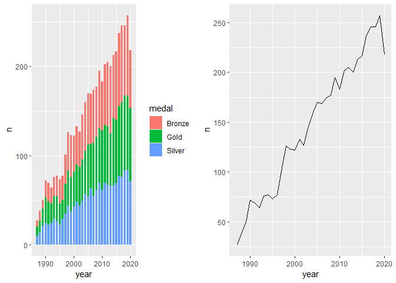
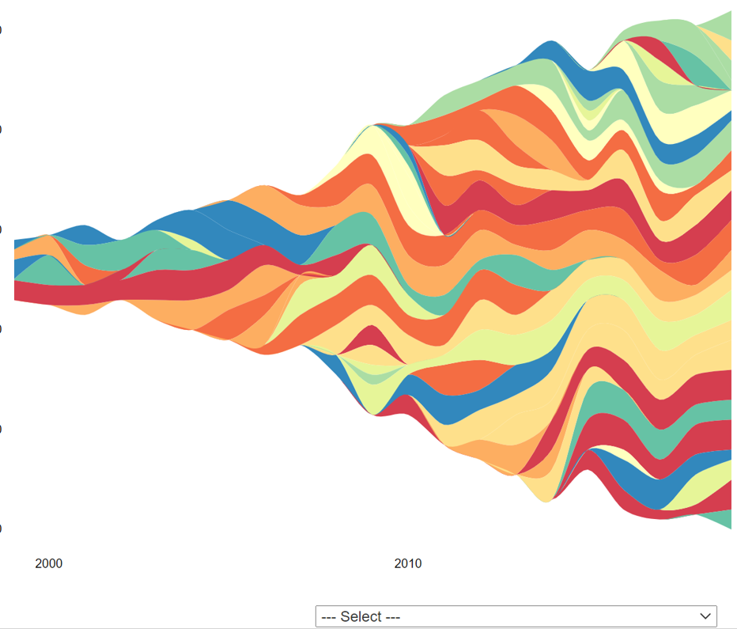
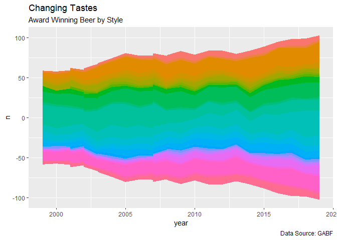
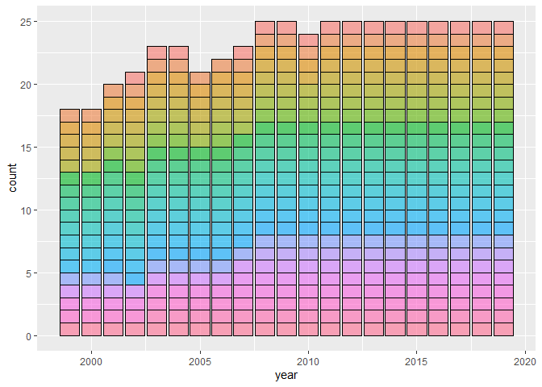
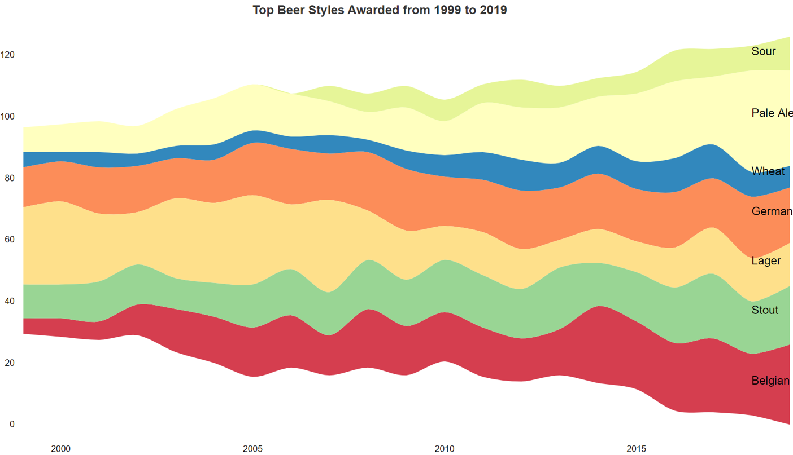

Explore Data
------------

Number of beers awarded medals per year. There is a steady year-on-year
rise until 2020 - is this because of COVID? May bookend analysis for
twenty years from 1999 to 2019

There were 515 different categories used in the dataset (from 1987 to
2020), but only 90 used in 2020 meaning,

-   Some categories were dropped or added
-   Some categories could be renamed

<!-- -->

    ## # A tibble: 20 x 2
    ##    category                          n
    ##    <chr>                         <int>
    ##  1 Classic Irish-Style Dry Stout    62
    ##  2 American-Style Pale Ale          61
    ##  3 Bock                             61
    ##  4 Robust Porter                    61
    ##  5 Imperial Stout                   60
    ##  6 German-Style Pilsener            59
    ##  7 German-Style Wheat Ale           56
    ##  8 American-Style Amber Lager       55
    ##  9 Brown Porter                     55
    ## 10 Irish-Style Red Ale              53
    ## 11 American-Style Brown Ale         51
    ## 12 Golden or Blonde Ale             49
    ## 13 Vienna-Style Lager               49
    ## 14 American-Style India Pale Ale    48
    ## 15 Oatmeal Stout                    48
    ## 16 Barley Wine-Style Ale            47
    ## 17 Rye Beer                         47
    ## 18 Specialty Beer                   47
    ## 19 Experimental Beer                45
    ## 20 Scottish-Style Ale               45

    ## # A tibble: 20 x 2
    ##    category                             n
    ##    <chr>                            <int>
    ##  1 American-Style Amber/Red Ale         3
    ##  2 American-Style Brown Ale             3
    ##  3 American-Style Fruit Beer            3
    ##  4 American-Style Pale Ale              3
    ##  5 American-Style Strong Pale Ale       3
    ##  6 American Amber Lager                 3
    ##  7 American Lager                       3
    ##  8 American Pilsener                    3
    ##  9 Belgian-Style Lambic or Sour Ale     3
    ## 10 Belgian-Style Specialty Ale          3
    ## 11 Belgian-Style Witbier                3
    ## 12 Bock                                 3
    ## 13 Bohemian-Style Pilsener              3
    ## 14 Classic Saison                       3
    ## 15 Coffee Beer                          3
    ## 16 Coffee Stout or Porter               3
    ## 17 Contemporary Gose                    3
    ## 18 English Ale                          3
    ## 19 English Mild or Bitter               3
    ## 20 Experimental Beer                    3

Will simplify the classifications to show broader beer types and reduce
the numver of different categories down to 23 (excluding ‘Other’)

    ## # A tibble: 25 x 2
    ##    SimpleCat        n
    ##    <chr>        <int>
    ##  1 Lager          554
    ##  2 Pale Ale       420
    ##  3 Stout          388
    ##  4 German Style   387
    ##  5 Belgian Beer   372
    ##  6 Pilsener       213
    ##  7 Wheat Beer     191
    ##  8 Porter         167
    ##  9 Fruit Beer     162
    ## 10 Red Ale        157
    ## # ... with 15 more rows

Start to explore how the styles have changed from 1999 to 2019 and what
might be a good visualization

    ## [1] "A Heatmap..."

    ## [1] "A Streamgraph..."

    ## [1] "A Streamgraph with original categories in 'other'..."

    ## [1] "Another Streamgraph..."

    ## [1] "A bar chart"

The streamgraph looks cool as is but need to narrow the number of beer
categories down and find a way to display a non-interactive legend (or
labels)

Now separate charts to show more detailed styles that are, 1 - gaining
in popularity and 2 - declining in popularity

    ## # A tibble: 4 x 5
    ## # Groups:   year [1]
    ##    year SimpleCat        n topCat  move
    ##   <dbl> <chr>        <int> <chr>  <dbl>
    ## 1  2019 Pale Ale        31 Y         23
    ## 2  2019 Belgian Beer    26 Y         21
    ## 3  2019 Sour            11 Y         11
    ## 4  2019 Stout           19 Y          8

    ## # A tibble: 4 x 5
    ## # Groups:   year [1]
    ##    year SimpleCat           n topCat  move
    ##   <dbl> <chr>           <int> <chr>  <dbl>
    ## 1  2019 Bock                2 N         -1
    ## 2  2019 Coffee Flavored     2 N         -2
    ## 3  2019 Smoke Flavored      3 N         -5
    ## 4  2019 Lager              14 Y        -11

Putting the charts together and adding titles and clean-up…

