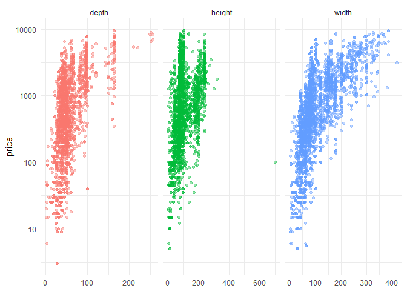
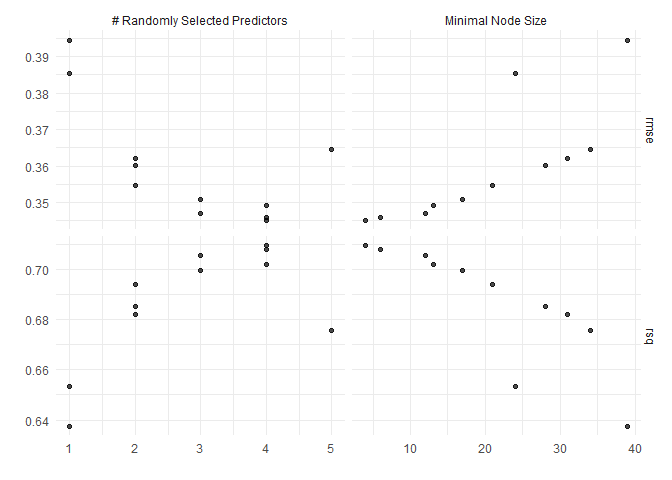
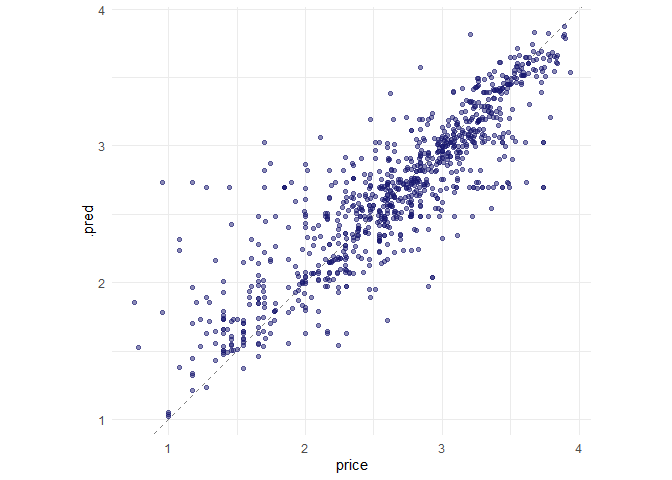
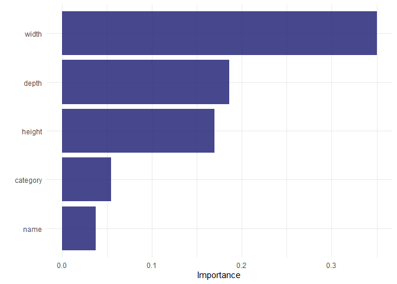

Walking through the [Julia Silge
video](https://juliasilge.com/blog/ikea-prices/) about tuning random
forests using the Tidy Tuesday IKEA dataset.

Exploratory Analysis
--------------------

Visualizing the data with price as the Y and width, height, and depth as
Xs. Take logs of price due to distribution.

``` r
ikea %>% select(X1, price, depth:width) %>% 
  pivot_longer(depth:width, names_to = "dim") %>% 
  ggplot(aes(value, price, color=dim)) + 
  geom_point(alpha=.4, show.legend = FALSE) +
  scale_y_log10() + 
  facet_wrap(~dim, scales = "free_x") +
  labs(x=NULL)
```



``` r
ikea_df <- ikea %>% select(price, name, category, depth, height, width) %>%
  mutate(price = log10(price)) %>% 
  mutate_if(is.character, factor)
```

Build Model
-----------

Use tidymodels to split data into training/testing based on a
price-stratified random sample

Then use bootstraps to create 25 subsets on the training data

``` r
set.seed(123)
ikea_split <- initial_split(ikea_df, strata = price)
ikea_train <- training(ikea_split)
ikea_test <- testing(ikea_split)

set.seed(234)
ikea_folds <- bootstraps(ikea_train, strata = price)
ikea_folds
```

    ## # Bootstrap sampling using stratification 
    ## # A tibble: 25 x 2
    ##    splits             id         
    ##    <list>             <chr>      
    ##  1 <split [2.8K/998]> Bootstrap01
    ##  2 <split [2.8K/1K]>  Bootstrap02
    ##  3 <split [2.8K/1K]>  Bootstrap03
    ##  4 <split [2.8K/1K]>  Bootstrap04
    ##  5 <split [2.8K/1K]>  Bootstrap05
    ##  6 <split [2.8K/1K]>  Bootstrap06
    ##  7 <split [2.8K/1K]>  Bootstrap07
    ##  8 <split [2.8K/1K]>  Bootstrap08
    ##  9 <split [2.8K/1K]>  Bootstrap09
    ## 10 <split [2.8K/1K]>  Bootstrap10
    ## # ... with 15 more rows

The usemodels package is a cool set of model creating functions. It will
generate the code needed to stand up common models.

In this case, you can set up a ranger random forest model using
*use\_ranger()* function - see the output…

``` r
library(usemodels)

use_ranger(price ~ ., data= ikea_train)
```

    ## ranger_recipe <- 
    ##   recipe(formula = price ~ ., data = ikea_train) 
    ## 
    ## ranger_spec <- 
    ##   rand_forest(mtry = tune(), min_n = tune(), trees = 1000) %>% 
    ##   set_mode("regression") %>% 
    ##   set_engine("ranger") 
    ## 
    ## ranger_workflow <- 
    ##   workflow() %>% 
    ##   add_recipe(ranger_recipe) %>% 
    ##   add_model(ranger_spec) 
    ## 
    ## set.seed(8577)
    ## ranger_tune <-
    ##   tune_grid(ranger_workflow, resamples = stop("add your rsample object"), grid = stop("add number of candidate points"))

Using the above function, we cut and paste the code and then modify to
suit your purposes.

``` r
library(textrecipes)

ranger_recipe <- 
  recipe(formula = price ~ ., data = ikea_train) %>% 
  step_other(name, category, threshold = .01) %>%
  step_clean_levels(name, category) %>%
  step_knnimpute(depth, height, width)

ranger_spec <- 
  rand_forest(mtry = tune(), min_n = tune(), trees = 1000) %>% 
  set_mode("regression") %>% 
  set_engine("ranger") 

ranger_workflow <- 
  workflow() %>% 
  add_recipe(ranger_recipe) %>% 
  add_model(ranger_spec) 

set.seed(91010)

ranger_tune <-
  tune_grid(ranger_workflow, 
            resamples = ikea_folds, 
            grid = 11)
```

Explore Results
---------------

Look at metrics from the possible models…

``` r
show_best(ranger_tune, metric="rmse")
```

    ## # A tibble: 5 x 8
    ##    mtry min_n .metric .estimator  mean     n std_err .config              
    ##   <int> <int> <chr>   <chr>      <dbl> <int>   <dbl> <chr>                
    ## 1     4     4 rmse    standard   0.345    25 0.00243 Preprocessor1_Model03
    ## 2     4     6 rmse    standard   0.346    25 0.00240 Preprocessor1_Model04
    ## 3     3    12 rmse    standard   0.347    25 0.00215 Preprocessor1_Model06
    ## 4     4    13 rmse    standard   0.349    25 0.00233 Preprocessor1_Model02
    ## 5     3    17 rmse    standard   0.351    25 0.00212 Preprocessor1_Model11

``` r
show_best(ranger_tune, metric="rsq")
```

    ## # A tibble: 5 x 8
    ##    mtry min_n .metric .estimator  mean     n std_err .config              
    ##   <int> <int> <chr>   <chr>      <dbl> <int>   <dbl> <chr>                
    ## 1     4     4 rsq     standard   0.709    25 0.00375 Preprocessor1_Model03
    ## 2     4     6 rsq     standard   0.708    25 0.00371 Preprocessor1_Model04
    ## 3     3    12 rsq     standard   0.706    25 0.00340 Preprocessor1_Model06
    ## 4     4    13 rsq     standard   0.702    25 0.00363 Preprocessor1_Model02
    ## 5     3    17 rsq     standard   0.699    25 0.00341 Preprocessor1_Model11

``` r
autoplot(ranger_tune)
```



Create finalized workflow using the best parameters

``` r
final_rf <- ranger_workflow %>%
  finalize_workflow(select_best(ranger_tune))

final_rf
```

    ## == Workflow ====================================================================
    ## Preprocessor: Recipe
    ## Model: rand_forest()
    ## 
    ## -- Preprocessor ----------------------------------------------------------------
    ## 3 Recipe Steps
    ## 
    ## * step_other()
    ## * step_clean_levels()
    ## * step_knnimpute()
    ## 
    ## -- Model -----------------------------------------------------------------------
    ## Random Forest Model Specification (regression)
    ## 
    ## Main Arguments:
    ##   mtry = 4
    ##   trees = 1000
    ##   min_n = 4
    ## 
    ## Computational engine: ranger

Create the final fit with the training and testing data…

``` r
ikea_fit <- last_fit(final_rf, ikea_split)
ikea_fit
```

    ## # Resampling results
    ## # Manual resampling 
    ## # A tibble: 1 x 6
    ##   splits        id           .metrics      .notes      .predictions    .workflow
    ##   <list>        <chr>        <list>        <list>      <list>          <list>   
    ## 1 <split [2.8K~ train/test ~ <tibble [2 x~ <tibble [0~ <tibble [922 x~ <workflo~

Look at the metrics computed on the text set to compare against the
re-sample results (above)

``` r
collect_metrics(ikea_fit)
```

    ## # A tibble: 2 x 4
    ##   .metric .estimator .estimate .config             
    ##   <chr>   <chr>          <dbl> <chr>               
    ## 1 rmse    standard       0.316 Preprocessor1_Model1
    ## 2 rsq     standard       0.765 Preprocessor1_Model1

Collect the predictions on the test set and plot the true vs predicted
price from the test set.

``` r
collect_predictions(ikea_fit) %>%
  ggplot(aes(price, .pred)) +
  geom_abline(lty = 2, color="gray50") +
  geom_point(alpha = .5, color = "midnightblue") + 
  coord_fixed()
```


The trained workflow is in the ikea\_fits object
*ikea\_fit$.workflow\[\[1\]\]* and if you have data, for example, row 15
of the test set, use it to predict a price

``` r
predict(ikea_fit$.workflow[[1]], ikea_test[15,])
```

    ## # A tibble: 1 x 1
    ##   .pred
    ##   <dbl>
    ## 1  2.72

``` r
ikea_test[15,]
```

    ## # A tibble: 1 x 6
    ##   price name   category depth height width
    ##   <dbl> <fct>  <fct>    <dbl>  <dbl> <dbl>
    ## 1  2.60 MINNEN Beds        NA     NA    85

``` r
predict(ikea_fit$.workflow[[1]], ikea_test[150,])
```

    ## # A tibble: 1 x 1
    ##   .pred
    ##   <dbl>
    ## 1  1.51

``` r
ikea_test[150,]
```

    ## # A tibble: 1 x 6
    ##   price name   category                   depth height width
    ##   <dbl> <fct>  <fct>                      <dbl>  <dbl> <dbl>
    ## 1  1.51 HACKÅS Bookcases & shelving units    18     NA    24

``` r
predict(ikea_fit$.workflow[[1]], ikea_test[100,])
```

    ## # A tibble: 1 x 1
    ##   .pred
    ##   <dbl>
    ## 1  1.67

``` r
ikea_test[100,]
```

    ## # A tibble: 1 x 6
    ##   price name  category                   depth height width
    ##   <dbl> <fct> <fct>                      <dbl>  <dbl> <dbl>
    ## 1  1.65 EKET  Bookcases & shelving units    34     10    34

Exploration of Feature Importance
---------------------------------

Width is the most important thing and name is the least important.

``` r
library(vip)

imp_spec <- ranger_spec %>% 
  finalize_model(select_best(ranger_tune)) %>%
  set_engine("ranger", importance = "permutation")

workflow() %>%
  add_recipe(ranger_recipe) %>%
  add_model(imp_spec) %>%
  fit(ikea_train) %>%
  pull_workflow_fit() %>%
  vip(aesthetics = list(alpha=.8, fill = "midnightblue"))
```


